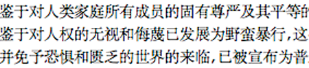

import ScriptDetails from '../../../../components/ScriptDetails.astro';
import ScriptResources from '../../../../components/ScriptResources.astro';
import WsList from '../../../../components/WsList.astro';

## Script details

<ScriptDetails />

## Script description

Simplified Han, also called Simplified Chinese, is the official script of the People's Republic of China (PRC) and Singapore.

Read the full description...
It is used for writing the varieties of the Chinese language spoken in these places. There is some debate as to whether varieties of Chinese (many of which are mutually unintelligible) should be classified as separate languages or dialects of a single language. Speakers of Chinese tend to perceive them as dialects, but some linguists consider this identification to be inappropriate. Given the high level of internal variation in the spoken language, it is the written form which has provided a means for unifying Chinese culture, as the same characters are used for representing the same concepts across dialects/languages. There are two styles of Chinese characters; traditional and simplified. The traditional form has been used since the 5th century AD, and the simplified form is generally associated with the formation of the PRC in 1949, who introduced the script in an effort to increase literacy, although some non-standard simplified forms existed long before this time.

The simplified forms of characters were created by modifying the traditional forms so that complex components of some characters were omitted entirely or replaced by a simpler component. Some traditional characters were replaced in print by their cursive equivalents, which tend to be visually simpler. Occasionally, less complex ancient forms of a character were adopted in place of the standard traditional form. Many simplified characters do not bear any immediate resemblance to their traditional equivalents unless the reader knows what modifications were applied. Some traditional forms were not modified at all so are the same in both scripts.

There is a problem of underdifferentiation in Simplified Han writing; reducing the number of strokes makes characters easier to write, but also reduces their distinctness for the reader by the same measure. Some words which were previously represented by distinct characters are now all represented by a single character and it must be determined from the context which interpretation is intended.

The exact number of Simplified Han characters varies from source to source, in part because the number is always growing as new words are added to the lexicon. A competent grasp of approximately 2,500 characters is considered by educators to be essential for basic reading and writing skills, and about 5,200 characters are estimated to account for over 99% of the characters in use. The _Xīnhuá zìdiăn_ (New China Character Dictionary) lists 8,075 characters. The canonical order of signs arranges them according to semantic classifications ranging from specific to general; signs related to mankind, minerals, height etc.

Simplified Han can be written vertically or horizontally, but modern texts are almost always written in horizontal lines from left-to-right. In some cases, particularly where Simplified Han is used alongside a right-to-left script, for example in a bilingual Chinese-Arabic dictionary, the Han characters may also be written from right to left. Vertical text alignment is often used on signposts which are longer than they are wide, as well as for aesthetic purposes, and is always used in calligraphic texts.

The adoption of Simplified Han characters has been controversial; supporters praise the script for its simplicity and claim that it is easier to learn, although there is no empirical evidence to suggest that the increase in China's literacy rate has been due to the simplified script as opposed to financial investment in education. Critics claim that there was a propaganda motive in disseminating the simpler characters; the Chinese Communist Cultural Revolution perceived anything "old" or "traditional" to be hampering progression, and some of the ways in which some characters were modified have been criticized for subtly trying to mold people's thinking. There is also some criticism of the government for disregarding the traditional characters which were viewed by some as representative of centuries of Chinese culture.

## Languages that use this script

<WsList script='Hans' wsMax='5' />

## Unicode status

In The Unicode Standard, Han implementation is discussed in [Chapter 18: East Asia](https://www.unicode.org/versions/latest/core-spec/chapter-18/#G29086).

- [Full Unicode status for Han](/scrlang/unicode/hani-unicode)

Other:

- [Unicode status for Currency](/scrlang/unicode/x-currency-unicode)

## Resources

<ScriptResources detailSummary='seemore' />

