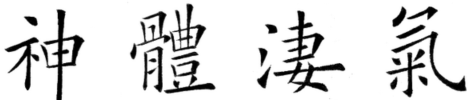

import ScriptDetails from '../../../../components/ScriptDetails.astro';
import ScriptResources from '../../../../components/ScriptResources.astro';
import WsList from '../../../../components/WsList.astro';

## Script details

<ScriptDetails />

## Script description

The Traditional Han script, also known as Traditional Chinese, developed from the Clerical script, ultimately from the Oracle Bone script, around the 5th century AD.

Read the full description...
It was used since that time throughout the Chinese-speaking world until the Communist government of China replaced it with the Simplified Han script in 1949. The simplified script is now the official script of the People's Republic of China (PRC) and of Singapore, but the traditional characters are still used in Taiwan, Hong Kong and Macau, as well as for aesthetic purposes in the PRC and Singapore.

There are five principles of character formation which have been used in developing the script. The _pictographic principle_ refers to signs which visually resemble the thing they represent, for example a dot within a circle for representing the concept 'sun'. The _simple indicative principle_ is related to this, but applies to more abstract concepts, such as 'above' which is represented by a particular mark above a horizontal line, or 'below' which is represented by a related mark below a horizontal line. The _compound indicative principle_ is used for compound signs, for example the combination of the 'sun' and 'moon' signs for representing the concept 'bright'. The _phonetic loan principle_ has been used in developing the signs for homphonous words. For example, the sound _ləg_ archaically meant both 'wheat' and 'to come', so a character visually resembling a sheaf of wheat is still used for representing the word 'come', although the two words are no longer pronounced alike. The last principle is the _semantic-phonetic principle_, whereby homophonous words represented by the same character are distinguished by adding a semantic element, sometimes called a determinative, classifier, signific or radical.

The script is neither purely phonetic nor purely logographic; rather, it can be seen as a very large and phonetically imprecise syllabary having a strong semantic element. Neither the phonetic nor the semantic component alone gives an exact indication of sound or meaning, but the combined phonetic and semantic associations provided by the character enables the reader to deduce the pronunciation and the meaning represented. For example, the character representing the concept 'sprain (ankle)', pronounced _bié_ is a combination of the phonetic element representing the sound _bì_, which means - among other things - 'shabby', and the semantic radical meaning 'foot'.

Both traditional and simplified Han characters have been designed to fit within the same sized square; there are no ascenders or descenders. Traditional Han characters are much more complex than their simplified equivalents, as would be expected. Characters are written with 12 basic strokes, but a given character can contain between 1 and 64 of these strokes. Each stroke is always written in the same direction, and there is a particular order in which strokes must be written when composing a character.

Traditional Han is written both vertically (more common in Taiwan) and horizontally (more common in Hong Kong and Macau). The alignment of the text is also influenced by the shape of the surface being written on, for example, text on a signpost which is longer than it is wide will be written vertically even in an area which tends to write horizontally. Vertical columns are read from right to left, but horizontal lines are read from left to right.

## Languages that use this script

<WsList script='Hant' wsMax='5' />

## Unicode status

In The Unicode Standard, Han implementation is discussed in [Chapter 18: East Asia](https://www.unicode.org/versions/latest/core-spec/chapter-18/#G29086).

- [Full Unicode status for Han](/scrlang/unicode/hani-unicode)

Other:

- [Unicode status for Currency](/scrlang/unicode/x-currency-unicode)

## Resources

<ScriptResources detailSummary='seemore' />

