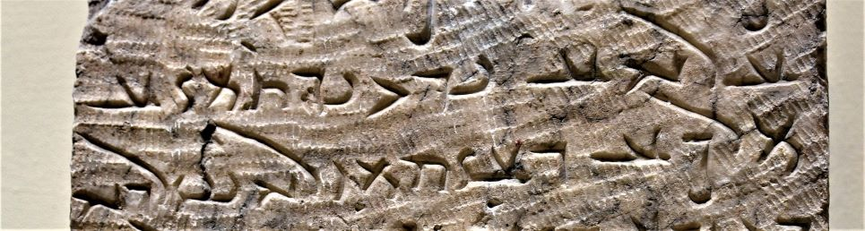

import ScriptDetails from '../../../../components/ScriptDetails.astro';
import WsList from '../../../../components/WsList.astro';
import ArticlesList from '../../../../components/ArticlesList.astro';
import SourceLinksList from '../../../../components/SourceLinksList.astro';
import BibList from '../../../../components/BibList.astro';

## Script details

<ScriptDetails />

## Script description

Hatran writing was discovered in 1912 in present-day al-Hadr, an ancient city in the al-Jazira region of Iraq which used to be called Hatra.

Read the full description...
Over 100 stone inscriptions were uncovered by archaeologists working for Iraqi Department of Antiquities; since then approximately 500 more texts have been discovered. Most of these were short, and as a result it has been difficult to deduce a great deal about the Aramaic dialect, called Aramaic of Hatra, which the script represented.

The Hatran script is an abjad; vowels were not written but [matres lectiones](/reference/glossary#matlec) were sometimes used to indicate the long vowels /o:/ and /ı:/.

## Languages that use this script

<WsList script='Hatr' wsMax='5' />

## Unicode status

In The Unicode Standard, Hatran script implementation is discussed in [Chapter 10 Middle East-II: Ancient Scripts](https://www.unicode.org/versions/latest/core-spec/chapter-10/#G34825).

- [Full Unicode status for Hatran](/scrlang/unicode/hatr-unicode)

## Resources

<ArticlesList tag='script-hatr' header='Related articles' />

<SourceLinksList tag='script-hatr' header='External links' entrytype='online' />

<BibList tag='script-hatr' header='Bibliography' entrytype='non-online' />

