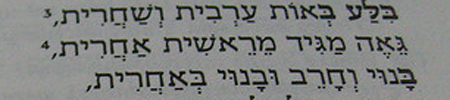

import ScriptDetails from '../../../../components/ScriptDetails.astro';
import WsList from '../../../../components/WsList.astro';
import ArticlesList from '../../../../components/ArticlesList.astro';
import SourcesList from '../../../../components/SourcesList.astro';
import BibList from '../../../../components/BibList.astro';

## Script details

<ScriptDetails />

## Script description

The Hebrew script is primarily used for writing the Hebrew, Samaritan and Yiddish languages.

Read the full description...
It is also used for writing some varieties of Arabic spoken in North Africa, Iraq and Yemen; the languages of the Jewish communities in Italy and Corfu, Morocco (Berber), Spain and the Caucasus mountains; and the modern Jewish Aramaic languages. Prior to 500 BC the Hebrew language was written in the Paleo-Hebrew script, which was abandoned after the Jewish exile in the 5th century BC in favour of the Aramaic script, from which the current Hebrew script descended. It is commonly called the Hebrew alphabet, after its first two letters _aleph_ and _bet_, although it is actually an abjad.

Hebrew is a unicameral script; there is only one case. It is written from right to left. The script contains twenty-two consonant letters, five of which take a variant form when used at the end of a word. Vowels are normally omitted when writing the Hebrew language, but four of the consonant letters א _aleph_, ה _he_, ו _waw_ and י _yod_ can be used for representing a number of (normally long) vowels when it is necessary to disambiguate between similar words. Until the 9th century, these letters, called _mater lectionis_ were the only means for representing vowels; later a system of diacritics, called _niqqud_ was introduced with the potential for fully representing long and short vowels in every word. Niqqud is rarely used outside of children's books, poetry, and books for teaching the Hebrew language. When writing the Yiddish language, vowels are fully expressed by means of a system derived but different from Hebrew vocalic representation (see Yiddish Orthography).

A number of cantillation marks are used in the scriptural scrolls (_Tanakh_) to indicate the rhythm and stress pattern for chanting the text aloud.

One ligature is commonly used in writing the Hebrew language, _alef lamed_ ﭏ. Four additional ligatures are used for writing Yiddish. The _tetragrammaton_ is also considered by many to be a ligature. It represents one of a number of sacred words which are not permitted to be written, so are represented by means of another symbol or set of symbols. The tetragarammaton does not refer to one specific symbol, but to any of a number of symbols representing the Hebrew word for God, composed of the letters J H W and H. Some Hebrew scribes use a ligature in place of any combination of these four letters, even when they appear within a different, secular word.

Punctuation in the Hebrew script is much the same as in the Latin script, with the exception of a script-specific hyphen _maqaf_, colon _sof pasuq_, forward/vertical slash _paseq_, abbreviation mark _geresh_, and a mark _gershayim_ to indicate that a word is an acronym.

Hebrew writing for the most part uses Latin numbers, although a system used to be in much more common use which assigned a numerical value of units, tens, or hundreds to each letter in the script inventory; the letters could then be added together to create any number. In modern texts this system is only used for the Hebrew calendar and other special cases.

There are four main styles of writing the Hebrew language. _Ashuri_ is a widely-used block style. A particular form of Ashuri, called _STA"M_ (an acronym for the Hebrew words for which this style is used), is used for sacred texts such as the Torah. _Rashi_ is a typeface commonly used for commentaries on sacred texts. A 'cursive' style is used in handwriting. This is characterized by rounded letter shapes; unlike other cursive scripts the letters are generally unconnected.

## Languages that use this script

:::note
A status of _obsolete_ indicates that the writing system is no longer in use for that language; the language may still be spoken.
:::

<WsList script='Hebr' wsMax='5' />

## Unicode status

In The Unicode Standard, Hebrew Script implementation is discussed in [Chapter 9 Middle East-I — Modern and Liturgical Scripts](https://www.unicode.org/versions/latest/core-spec/chapter-9/#G6528).

- [Full Unicode status for Hebrew](/scrlang/unicode/hebr-unicode)

Other:

- [Unicode status for General Punctuation](/scrlang/unicode/x-gen-punct-unicode)

## Resources

<ArticlesList tag='script-hebr' header='Related articles' />

<SourcesList tag='script-hebr' header='External links' entrytype='non-online' />

<BibList tag='script-hebr' header='Bibliography' entrytype='non-online' />

