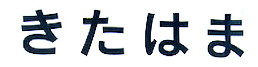

import ScriptDetails from '../../../../components/ScriptDetails.astro';
import ScriptResources from '../../../../components/ScriptResources.astro';
import WsList from '../../../../components/WsList.astro';

## Script details

<ScriptDetails />

## Script description

The Hiragana script (sometimes called Kiragana) is one of the two Japanese syllabaries, along with Katakana.

Read the full description...
The script was derived from the cursive forms of Chinese characters around the 8th century; prior to this, Japanese was written entirely in Chinese (_kanji_ letters. Hiragana was originally known as _onnade_ 'women's hand' as it was primarily used by women until the 10th century when it came to be widely used by both genders.

The script can be written either horizontally or vertically. There are 48 signs, called _kana_, 5 representing vowels, one representing the syllabic nasal /n/, and 42 representing consonant+vowel syllables. Each kana represents one mora, essentially a short syllable. Long syllables are represented by two kana. There are no symbols for writing voiced stops; rather, two small strokes called _nigoriten_ are written at the upper right of a CV symbol to indicate that the consonant is voiced. There are also no symbols for syllables containing [p], but a small circle (_maru_) is written to the upper right of the symbols _ha_, _hi_, _hu_, _he_ and _ho_ to represent _pa_, _pi_, _pu_, _pe_ and _po_ respectively. The script was officially standardized in 1946 to reflect spoken modern standard Japanese, although there are some exceptions to this: the grammatical markers for topic [wa], direct object [ɔ] and direction [ɛ] are written with the symbols _ha_, _wo_ and _he_ respectively, reflecting historical pronunciation.

The Hiragana script is a complete orthography - anything that can be said in Japanese can be written in Hiragana - but it is most commonly mixed with Chinese _Kanji_ characters. In texts which use a mixture of Hiragana and Kanji characters, Hiragana is commonly used to write words phonetically, sometimes as a guide to pronunciation, and to write sentence particles and inflectional endings.

There are two arrangements in which symbols can be ordered. The traditional order of symbols is the order in which they appear in a short poem, the _iroha_, which uses each syllable only once. However, the _gojuuon_ "fifty sound" order is now more commonly used.

## Languages that use this script

<WsList script='Hira' wsMax='5' />

## Unicode status

In The Unicode Standard, Hiragana implementation is discussed in [Chapter 18: East Asia](https://www.unicode.org/versions/latest/core-spec/chapter-18/#G22344).

- [Full Unicode status for Hiragana](/scrlang/unicode/hira-unicode)

Other:

- [Unicode status for Hiragana + Katakana](/scrlang/unicode/z-hiragana-katakana-unicode)

## Resources

<ScriptResources detailSummary='seemore' />

