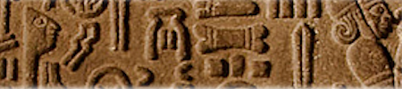

import ScriptDetails from '../../../../components/ScriptDetails.astro';
import ScriptResources from '../../../../components/ScriptResources.astro';
import WsList from '../../../../components/WsList.astro';

## Script details

<ScriptDetails />

## Script description

Anatolian Hieroglyphs were used for writing the Luwian language from the second millennia BC until the early 7th century BC.

Read the full description...
The script has also been called ‘Hittite Hieroglyphs’ as it was once thought that they had been used for writing the Hittite language; however we now know that was not the case.

There are approximately five hundred signs attested in inscriptions on stone and lead. These have both syllabic and logographic components. Words could be written entirely with logographs (in particular at the earlier period), or with phonetic complements in a variety of configurations.

## Languages that use this script

<WsList script='Hluw' wsMax='5' />

## Unicode status

In The Unicode Standard, Anatolian Hieroglyphs script implementation is discussed in [Chapter 11 Cuneiform and Hieroglyphs](https://www.unicode.org/versions/latest/core-spec/chapter-11/#G27920).

- [Full Unicode status for Anatolian Hieroglyphs](/scrlang/unicode/hluw-unicode)

## Resources

<ScriptResources detailSummary='seemore' />

