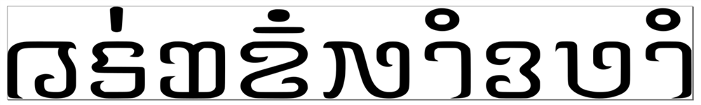

import ScriptDetails from '../../../../components/ScriptDetails.astro';
import ScriptResources from '../../../../components/ScriptResources.astro';
import WsList from '../../../../components/WsList.astro';

## Script details

<ScriptDetails />

## Script description

The Nyiakeng Puachue Hmong script is is used for writing the White Hmong and Green Hmong languages.

Read the full description...
This script has been used by members of the United Christians Liberty Evangelical church in America for more than 25 years, in printed material and videos. It is reported to have some use in Laos, Thailand, Vietnam, France, and Australia.

Nyiakeng Puachue Hmong is an alphabetic script comprised of 36 consonant characters, 9 vowel characters, and 7 combining tone characters.

## Languages that use this script

<WsList script='Hmnp' wsMax='5' />

## Unicode status

In The Unicode Standard, Nyiakeng Puachue Hmong script implementation is discussed in [Chapter 16: Southeast Asia-I — Thailand, Laos, Myanmar, Cambodia, Vietnam](https://www.unicode.org/versions/latest/core-spec/chapter-16/#G81876).

- [Full Unicode status for Nyiakeng Puachue Hmong](/scrlang/unicode/hmnp-unicode)

## Resources

<ScriptResources detailSummary='seemore' />

