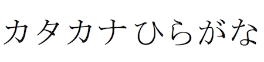

import ScriptDetails from '../../../../components/ScriptDetails.astro';
import WsList from '../../../../components/WsList.astro';
import ArticlesList from '../../../../components/ArticlesList.astro';
import SourceLinksList from '../../../../components/SourceLinksList.astro';
import BibList from '../../../../components/BibList.astro';

## Script details

<ScriptDetails />

## Script description

The Japanese language is written in a mixture of scripts; _kanji_, which are derived from Chinese characters and represent logographic or morphological units, and _kana_, a pair of syllabaries.

Read the full description...
The two kana are called _hiragana_ and _katakana_. A single text usually contains all three scripts. Kanji are used for writing nouns, verb stems, adjective stems and some adverbs. Hiragana is used primarily for grammatical elements - particles, inflectional endings, and auxiliary verbs. Katakana is used for writing loan words, onomatopoeic words, to give emphasis, to suggest a conversational tone, or to indicate irony or a euphemism.

Prior to the development of the two kana, Japanese was written entirely using kanji symbols. These were used phonetically to represent similar-sounding Japanese syllables; the meanings of the characters were initially ignored. However, as each kanji corresponds to only one syllable, in order to write a polysyllabic Japanese word, of which there are many, several kanji had to be employed. As kanji frequently consist of a large number of strokes, this was a laborious process. A simplified cursive style of writing began to be used by Japanese women around the 7th and 8th centuries; from this cursive style the hiragana characters developed. In modern written Japanese, many kanji characters can be read in two ways. _On_-readings are based on the pronunciation of the Chinese character at the time of borrowing, irrespective of meaning, and _kun_-readings represent a Japanese morpheme corresponding to the meaning of a particular character.

Katakana was created shortly after hiragana, by students of Buddhism who needed some kind of phonetic shorthand in which they could rapidly take notes during lectures. Unlike hiragana, katakana are generally not simplifications of entire kanji characters, but are based on a single component of a kanji.

Each kana consists of one to four strokes. Strokes are written from top to bottom and from left to right.

The two scripts were standardized in 1900, since that time two characters have become obsolete, leaving 46 in use.

The two syllabaries developed in the 9th century and are based on kanji characters. Hiragana means "kana without angles" and katakana means "simple, incomplete kana", which gives some indication as to the appearance of both scripts.

The kana scripts can be written either in vertical columns from right to left, or in horizontal lines from left to right. In handwriting, the Japanese language tends not to be written on lined paper but in a printed or imaginary grid of squares. All the kana symbols have been designed to fit into a square of the same proportions.

## Languages that use this script

<WsList script='Hrkt' wsMax='5' />

## Unicode status

- [Unicode status for Hiragana](/scrlang/unicode/hira-unicode)
- [Unicode status for Katakana](/scrlang/unicode/kana-unicode)

## Resources

<ArticlesList tag='script-hrkt' header='Related articles' />

<SourceLinksList tag='script-hrkt' header='External links' entrytype='online' />

<BibList tag='script-hrkt' header='Bibliography' entrytype='non-online' />