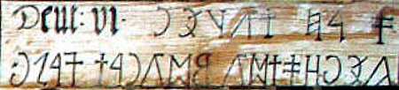

import ScriptDetails from '../../../../components/ScriptDetails.astro';
import ScriptResources from '../../../../components/ScriptResources.astro';
import WsList from '../../../../components/WsList.astro';

## Script details

<ScriptDetails />

## Script description

The Old Hungarian script (in Hungarian _rovásírás_) is the earliest known writing system amongst the Uralic languages.

Read the full description...
As early as the 6th century, Chinese accounts noted the Hungarian custom of writing with incised marks on small wooden tablets. The script may be derived from Old Turkic writing.

There is some discussion regarding the direction of writing; it appears that Old Hungarian was written both from right to left and from left to right. In very early times, when the script was written on wooden sticks, the stick was turned as each line was written so that the text appeared in [boustrophedon](/reference/glossary#boust) style. The boustrophedon style was not used for writing larger texts on walls or manuscripts, which tended to be written from right to left. Significant discussion has centered around this issue in the context of encoding the script for use on computers. Academic preference is generally for a left to right directionality, but modern users are more likely to write it from right to left.

There are 45 basic letters in the script, which are able to represent all the sounds of Hungarian. That is not to say the orthography was phonemic; vowels were only written where it was ambiguous to omit them. Letters could be combined to form numerous ligatures. Historically, ligatures were not standardized, but used freely and inconsistently throughout handwritten texts. The same sequence of sounds could optionally be written with multiple signs or with a ligature. The script employed a single case, although the first letter of proper nouns was sometimes written slightly larger than the rest. There were also some non-alphabetic symbols, the functions of which seem to be unclear.

Around the year 1000, the first Hungarian king, István/Stephen I was crowned. Under his rule, the country officially switched to using the Latin script, though some examples of religious texts written in the script have been dated to that period. During the 15th century it became fashionable in some circles to use the Old Hungarian script, although it was never used in any official capacity. Since 1915 various attempts have been made to revive the script, with limited success. It is often used in a symbolic way, for example on public signage in Budapest, or for writing secret messages by schoolchildren and teenagers.

## Languages that use this script

<WsList script='Hung' wsMax='5' />

## Unicode status

In The Unicode Standard, Old Hungarian script implementation is discussed in [Chapter 8 Europe-II](http://www.unicode.org/versions/latest/ch08.pdf).

- [Full Unicode status for Old Hungarian](/scrlang/unicode/hung-unicode)

## Resources

<ScriptResources detailSummary='seemore' />

