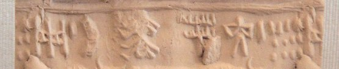

import ScriptDetails from '../../../../components/ScriptDetails.astro';
import WsList from '../../../../components/WsList.astro';
import ArticlesList from '../../../../components/ArticlesList.astro';
import SourceLinksList from '../../../../components/SourceLinksList.astro';
import BibList from '../../../../components/BibList.astro';

## Script details

<ScriptDetails />

## Script description

The Indus script (also called the Harappan script) was used by the Harappan cultures living in the Indus valley between roughly 3000 - 1900 BC.

Read the full description...
Although the script was discovered in 1875 and there have been numerous attempts to decipher it, little is known about the configuration of the symbols. There are no remaining examples of the formative stages of the script, so it is not possible to trace a genetic affiliation to any other known script. Furthermore, the script died out in 1900 BC with the Indus Valley Civilization, leaving no descendents.

There has been some controversy surrounding the script, as to whether it represented a spoken language at all, or whether the symbols were merely religious or political symbols having no linguistic content. In 2004 a paper entitled "The Collapse of the Indus-Script Thesis" (this can be read in full [here](http://www.safarmer.com/fsw2.pdf)) was the first widely-read suggestion that the symbols discovered in the Indus Valley may not have represented a language. The author's claims were refuted by a statistical study comparing the pattern of symbols to other linguistic and non-linguistic systems, which found that the Indus script's pattern more closely matched the pattern of linguistic systems. This article can be purchased [here](http://www.sciencemag.org/cgi/content/abstract/1170391). This debate continues. Even amongst those scholars who agree that the script did represent a spoken language, there is disagreement as to whether the language represented was Dravidian or Indo-Aryan.

What is agreed upon is that each symbol probably represented a concept or part of a concept, as opposed to purely phonetic content. Estimates as to the number of signs used vary, but tend to be around four hundred. Extant texts consist of between one and seventeen signs, but are normally fairly short, containing about 5 signs. Words are thought to have been composed of up to three signs, although word division was not marked in any way so this is not known for certain.

The script was generally written from right to left, although some exceptions to this have been found.

## Languages that use this script

<WsList script='Inds' wsMax='5' />

## Unicode status

The Indus script is not yet in Unicode. The script has a tentative allocation at U+1BA00..U+1BB8F in the [Roadmap to the SMP](http://www.unicode.org/roadmaps/smp/) for the Unicode Standard.

- [Full Unicode status for Indus](/scrlang/unicode/inds-unicode)

## Resources

<ArticlesList tag='script-inds' header='Related articles' />

<SourceLinksList tag='script-inds' header='External links' entrytype='online' />

<BibList tag='script-inds' header='Bibliography' entrytype='non-online' />

