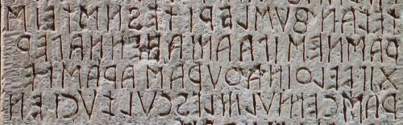

import ScriptDetails from '../../../../components/ScriptDetails.astro';
import WsList from '../../../../components/WsList.astro';
import ArticlesList from '../../../../components/ArticlesList.astro';
import SourcesList from '../../../../components/SourcesList.astro';
import BibList from '../../../../components/BibList.astro';

## Script details

<ScriptDetails />

## Script description

The Old Italic scripts are a group of alphabets descended from Greek which were used for writing a number of languages spoken in what is now Italy.

Read the full description...
The exact relationship of the Old Italic scripts to one another is uncertain. The most notable among them are Etruscan, Oscan, Faliscan, (ancient) Latin, Umbrian and Messapic. Scripts including the ancient Raetic, Venetic, Lepontic and Gallic scripts were previously termed the Alpine (or North Italic) scripts; these are now considered to belong to the Old Italic scripts.

The Runic and modern Latin scripts were based on the Old Italic alphabets.

## Languages that use this script

:::note
A status of _obsolete_ indicates that the writing system is no longer in use for that language; the language may still be spoken.
:::

<WsList script='Ital' wsMax='5' />

## Unicode status

In The Unicode Standard, Old Italic implementation is discussed in [Chapter 8 Europe-II: Ancient and Other Scripts](https://www.unicode.org/versions/latest/core-spec/chapter-8/#G27379) and in [UTN 40: Old Italic Glyph Variation](https://www.unicode.org/notes/tn40/). Language-specific fonts are required for processing text, as some of the common glyphs may differ slightly from language to language.

- [Full Unicode status for Old Italic](/scrlang/unicode/ital-unicode)

## Resources

<ArticlesList tag='script-ital' header='Related articles' />

<SourcesList tag='script-ital' header='External links' entrytype='non-online' />

<BibList tag='script-ital' header='Bibliography' entrytype='non-online' />

