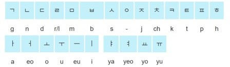

import ScriptDetails from '../../../../components/ScriptDetails.astro';
import ScriptResources from '../../../../components/ScriptResources.astro';
import WsList from '../../../../components/WsList.astro';

## Script details

<ScriptDetails />

## Script description

[Hangul](/scrlang/scripts/hang) is the phonetic writing system developed in 1446 for writing the Korean language.

Read the full description...
The Unicode Standard contains both the complete set of precomposed modern Hangul syllable blocks and a set of conjoining Hangul Jamo. These are the individual letters which combine to form Hangul syllables. There are 51 letters which make up the script: 14 simple consonant, 5 glottalized double letters, 11 consonant clusters, 6 simple vowels, 11 diphthongs, and 4 simple iotized (that is, preceded by a y sound) vowels. Spoken Korean employs syllables of V, VC, VCC, CV, CVC and CVCC configurations. In writing, jamo are grouped into syllable blocks by modifying their size, shape and position to reflect their position in the spoken syllable.

The shape of each jamo reflects the articulation of sound it represents, with particular elements relating to place and manner of articulation, or to iotation of vowels. For example, the symbol ㅁ /m/ is a picture of two pursed lips, ㅂ /b/ is the same shape but with two elongated strokes representing the plosive manner of articulation. Consonant jamo are comprised of vertical, horizontal and diagonal lines, as well as curves and circles. Vowel jamo consist of vertical and horizontal lines only. The shape of vowels is based on a horizontal line representing the earth (yin), a point or short stroke representing the sun (yang), and a vertical line representing mankind.

The conjoining Hangul Jamo can be used to represent all of the modern Hangul syllable blocks, as well as the ancient syllable blocks used in Old Korean.

## Languages that use this script

<WsList script='Jamo' wsMax='5' />

## Unicode status

In The Unicode Standard, Hangul implementation is discussed in [Chapter 18 East Asia](http://www.unicode.org/versions/latest/ch18.pdf).

- [Full Unicode status for Hangul](/scrlang/unicode/hang-unicode)

## Resources

<ScriptResources detailSummary='seemore' />

