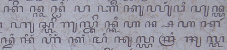

import ScriptDetails from '../../../../components/ScriptDetails.astro';
import ScriptResources from '../../../../components/ScriptResources.astro';
import WsList from '../../../../components/WsList.astro';

## Script details

<ScriptDetails />

## Script description

Javanese is Indonesia's oldest literary language, its literary history being traceable to the C4th.

Read the full description...
Since that time, it has been written in several different scripts - Pallava, Old Javanese, and an Arabic variant known as _gundil_ script - before arriving at its present form in the C17th and 18th. The present Javanese script is a modern variant of Old Kawi, an ancient Brahmic script from which many scripts in the Indonesian archipelago are derived. It is the pre-colonial script of the Javanese language spoken on the Indonesian islands of Java and Bali and is used to write the Tengger and Osing languages, also spoken in Java and Bali. Historically it was also used to write the Bali language, which is now written largely in the Latin and Balinese scripts, and the Sunda language, which is now written in the Latin and Arabic scripts. The Javanese script is closely related to the Balinese script, although Javanese contains 4 consonant letters which are absent in the Balinese.

The Javanese script is an abugida written from left to right. It comprises 20 consonants each having an inherent [a] vowel, and 5 vowel diacritics representing the 9 vowel phonemes of the spoken language. Although some diacritics therefore represent two phonemes, the potential for ambiguity in this regard is eliminated by rules concerning vowel pronunciation and context. Syllable-final consonants can be modified with a virama device called _patèn_, which mutes the inherent vowel. In addition, each consonant has a counterpart for use, commonly in subscript form, in writing consonant clusters. These are called _pasangan_ letters. 

There is an optional set of vowel characters which may be used to indicate syllable-initial vowels, and a further set of optional 'honourific' graphemes used to indicate a highly respected person. As foreign loan words have been adopted into the Javanese language throughout the islands' history, special characters have been introduced to accommodate non-Javanese sounds. 

The Javanese script employs punctuation marks roughly corresponding in purpose to the comma, full-stop, colon, and quotation marks, as well as to introduce a new sentence or paragraph, to indicate rank distinctions between writer and recipient in correspondence, and to mark the beginning and end of a poem, or a melody change in songs. The alphabet is traditionally ordered in such a way that the names of the letters form a poem, translated as 'There were (two) emissaries, they began to fight, their valour was equal, they both fell dead'. Javanese numerals can be written either in the Javanese, Latin or Arabic scripts.

The first Javanese upright-style font was produced in the 1830s by the Dutch. Early in the C20th, two other cursive type fonts were also produced. Further development was halted abruptly during the second World War when the use of the Javanese script was prohibited under the Japanese occupation. Currently, there are no newspapers or magazines being printed in the Javanese script, although it is still taught in most elementary schools and some junior high schools in Javanese speaking areas.

## Languages that use this script

:::note
A status of _obsolete_ indicates that the writing system is no longer in use for that language; the language may still be spoken.
:::

<WsList script='Java' wsMax='5' />

## Unicode status

In The Unicode Standard, Javanese script implementation is discussed in [Chapter 17: Southeast Asia-II — Indonesia and the Philippines](https://www.unicode.org/versions/latest/core-spec/chapter-17/#G27153) and in [UTN 47: Implementing Javanese](https://www.unicode.org/notes/tn47/).

- [Full Unicode status for Javanese](/scrlang/unicode/java-unicode)

## Resources

<ScriptResources detailSummary='seemore' />

