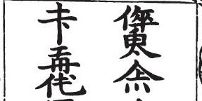

import ScriptDetails from '../../../../components/ScriptDetails.astro';
import WsList from '../../../../components/WsList.astro';
import ArticlesList from '../../../../components/ArticlesList.astro';
import SourcesList from '../../../../components/SourcesList.astro';
import Bibliography from '../../../../components/Bibliography.astro';

## Script details

<ScriptDetails />

## Script description

The Jurchen script (also called Jurchi, Jurchin or Southern Tungusic) was created in 1120 by Wanyan Xiyin, advisor of the Jurchen chieftain Wanyan Aguda, who later became the first emperor of the Jin Dynasty.

Read the full description...
The script was used for writing the Jurchen language; however, both the script and the language are now extinct and there are very few surviving samples of Jurchen text. Almost all surviving examples of the script are inscriptions on monuments, pottery, mirrors etc., although there are references in Chinese texts to a large body of literature written in the script. One of the most important extant texts is an inscription on the back of the Jin Victory Memorial Stele which was erected in 1185. The Jurchen text is an abbreviated translation of the Chinese text on the front of the stele.

The Jurchen script was largely logographic, and contained 720 radicals, similar to the Chinese characters on which they were based. Many characters were directly borrowed from Chinese. Broadly speaking, characters fell into two classes; ideographic characters representing words or portions of words, and phonetic characters representing a sound. However, some characters performed a dual function and represented words in some contexts and sounds in others. Logographs could be combined to form compound words. 

The script appears to have been widely known and used by the Jurchen people, as evidenced by numerous examples of graffiti left by Jurchen travellers in Inner Mongolia. After the 16th century the Jurchen people became known as Manchu (or Manchurians) and gradually adopted the Mongolian script. The Mongolian script had entirely replaced Jurchen writing by the 17th century.

## Languages that use this script

<WsList script='Jurc' wsMax='5' />

## Unicode status

The Jurchen script is not yet in Unicode. The script has a tentative allocation at U+18E00..U+191DF in the [Roadmap to the SMP](http://www.unicode.org/roadmaps/smp/) for the Unicode Standard.

- [Full Unicode status for Jurchen](/scrlang/unicode/jurc-unicode)

## Resources

<ArticlesList tag='script-jurc' header='Related articles' />

<SourcesList tag='script-jurc' header='External links' />

<Bibliography tag='script-jurc' header='Bibliography' />

