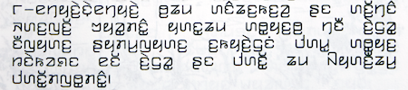

import ScriptDetails from '../../../../components/ScriptDetails.astro';
import WsList from '../../../../components/WsList.astro';
import ArticlesList from '../../../../components/ArticlesList.astro';
import SourceLinksList from '../../../../components/SourceLinksList.astro';
import BibList from '../../../../components/BibList.astro';

## Script details

<ScriptDetails />

## Script description

Kayah Li is used to write the Eastern and Western Kayah languages, spoken by 26,000 and 150,000 people respectively.

Read the full description...
These are Karen languages native to Eastern Myanmar but also spoken by significant refugee populations in Thailand. The script was created in 1962 by Htae Bu Phae. It bears noticeable similarities to the Myanmar script and to the Indic scripts. The Kayah languages can also be written using the Myanmar script.

The script is of Brahmic origin but, unusually, it is an alphabet rather than an abugida. Four of the nine Kayah vowel sounds are written with spacing letters; the remaining five are written with the spacing letter _a_, modified by diacritics. Non-native sounds are written by using the same vowel diacritics to modify the spacing letter _oe_.

Every vowel sound carries a tone. Tone is indicated by vowel marks written below the four spacing vowel letters (bearing in mind that two of these letters can be used to write all the other vowels). Where a tone mark and a vowel diacritic are both applied to a spacing letter, the vowel is conventionally written first, as the tone applies to the syllable as a whole.

There is a set of script-specific digits 0-9. Two punctuation marks also exist: one to represent extended intonation and one to separate sentences or phrases. In addition, conventional Latin punctuation marks are used. Spaces are used between words.

Kayah Li was added to the Unicode Standard in 2008.

## Languages that use this script

<WsList script='Kali' wsMax='5' />

## Unicode status

In The Unicode Standard, Kayah Li script implementation is discussed in [Chapter 16: Southeast Asia-I — Thailand, Laos, Myanmar, Cambodia, Vietnam](https://www.unicode.org/versions/latest/core-spec/chapter-16/#G61902).

- [Full Unicode status for Kayah Li](/scrlang/unicode/kali-unicode)

## Resources

<ArticlesList tag='script-kali' header='Related articles' />

<SourceLinksList tag='script-kali' header='External links' entrytype='online' />

<BibList tag='script-kali' header='Bibliography' entrytype='non-online' />
