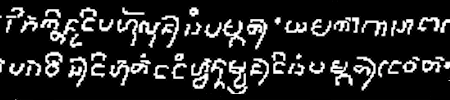

import ScriptDetails from '../../../../components/ScriptDetails.astro';
import ScriptResources from '../../../../components/ScriptResources.astro';
import WsList from '../../../../components/WsList.astro';

## Script details

<ScriptDetails />

## Script description

The Kawi script descended from the [Grantha](/scrlang/scripts/gran) script around the 8th century BC and was used across the islands of Borneo, Java, Bali, and Sumatra.

Read the full description...
The script originated in Java, and as a result is also sometimes called Old Javanese.

Kawi was an abugida; consonant characters are read with an inherent vowel. Diacritics are added to the consonant either to suppress the vowel entirely or to change it to a different vowel.

The Kawi alphabet developed around the 16th century AD into the current [Javanese](/scrlang/scripts/java) script. This transition was more stylistic than structural; the visual composition of the script changed but the way it worked stayed the same.

## Languages that use this script

:::note
A status of _obsolete_ indicates that the writing system is no longer in use for that language; the language may still be spoken.
:::

<WsList script='Kawi' wsMax='5' />

## Unicode status

In The Unicode Standard, Kawi script implementation is discussed in [Chapter 17 Southeast Asia-II — Indonesia and the Philippines](https://www.unicode.org/versions/latest/core-spec/chapter-17/#G40419) and in [UTN 48: Implementing Kawi](https://www.unicode.org/notes/tn48/).

- [Full Unicode status for Kawi](/scrlang/unicode/kawi-unicode)

## Resources

<ScriptResources detailSummary='seemore' />

