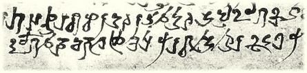

import ScriptDetails from '../../../../components/ScriptDetails.astro';
import ScriptResources from '../../../../components/ScriptResources.astro';
import WsList from '../../../../components/WsList.astro';

## Script details

<ScriptDetails />

## Script description

Early writing in India is associated with three scripts; Indus (Harrapan), Brahmi and Kharoshthi.

Read the full description...
The Kharoshthi script descended from Aramaic and was used in what is now Northern Pakistan and Eastern Afghanistan during the 4th or 5th century BC. It was used for about 700 years for writing a group of vernacular middle Indo-Aryan dialects collectively termed 'Prakrit'. There has been some evidence that local variants of Kharoshthi writing were used for even longer than this along the Silk Route, but these too later died out without leaving any descendants.

Kharoshthi was an abugida based on the graphic syllable called _akṣara_, which contains an inherent [a] vowel. Other vowels were written by attaching diacritics to the akṣara, which overrode the inherent [a]. Initial vowels having no preceding consonant were written using a 'dummy consonant' letter in which the consonant was silent but the inherent [a] was pronounced. Vowel diacritics could be attached to this letter as to any other consonant letter. Vowel length was generally not written, except in some later documents which used a diacritic stroke to indicate a long vowel.

The script was written from right to left in a cursive style. The letters were ordered according to what is now referred to as the Arapacana alphabet. This order was used as a mnemonic device in tantric Buddhist rituals.

The Prakrit languages for which Kharoshthi was used did not employ the same sound system as Sanskrit, so not all of the letters present in most South Asian scripts are present in Kharoshthi. For example, there are no means of representing syllabic r or l, velar nasal _ṅ_, and no _visarga_. However, there is a diacritic mark which is written above intervocalic consonants, thought to represent a phonological process such as frication.

A set of numerals 1-4, 10, 20, 100 and 1000 was used. There were also 9 punctuation marks.

## Languages that use this script

<WsList script='Khar' wsMax='5' />

## Unicode status

In The Unicode Standard, Kharoshthi script implementation is discussed in [Chapter 14 South and Central Asia-III: Ancient Scripts](http://www.unicode.org/versions/latest/ch14.pdf).

- [Full Unicode status for Kharoshthi](/scrlang/unicode/khar-unicode)

## Resources

<ScriptResources detailSummary='seemore' />

