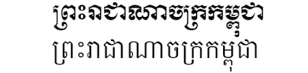

import ScriptDetails from '../../../../components/ScriptDetails.astro';
import WsList from '../../../../components/WsList.astro';
import ArticlesList from '../../../../components/ArticlesList.astro';
import SourcesList from '../../../../components/SourcesList.astro';
import Bibliography from '../../../../components/Bibliography.astro';

## Script details

<ScriptDetails />

## Script description

The Khmer script is an abugida, descended from the Brahmic script Pallava.

Read the full description...
It is used for writing Khmer, the official language of Cambodia. The script is also sometimes used for writing minority languages in Cambodia, such as Brao and Mnong.

The alphabet has 33 consonants. Two more consonants that are included in Unicode are not in everyday use. Like many of the Brahmic abugidas, each symbol comprises a consonant and an inherent vowel. However, unlike most other Brahmic scripts, Khmer has two registers of consonants, one containing an inherent [a] and one containing an inherent [o]. Most consonants have two different letterforms for these two registers. Those that do not have a second form can be modified by one of two diacritics to indicate a change of register. Each consonant can also appear in a 'subscript' form, called _coeng_. In most cases these are a smaller version of the 'full' form, but in some cases they are unrelated in appearance. Coeng are written below the consonant they follow in pronunciation, but can extend above the baseline to the left or the right of that consonant. Rarely, coeng can be attached to a vowel character or used to indicate a word-final consonant, but their primary use is in consonant clusters. Some coeng in loanwords remain unpronounced.

Vowels are represented by means of diacritics written above, below and/or alongside on either side of the consonant to modify the quality of the inherent vowel. Most of these vowel-diacritics have a different effect on a consonant containing [a] than they do on one containing [o]. Independent vowel symbols also exist for representing syllable-initial vowels, but some are also written using the 'q' character modified by the appropriate vowel diacritic. Spelling conventions often dictate which of these means of representation is used.

There are additional diacritics that may or may not modify the pronunciation.

The superscript _robat_ character, which is used in some related scripts if the consonant RO is the first consonant in the syllable, is, in Khmer, only an artefact of original spellings in some loanwords and is not pronounced. 

The Khmer literary tradition dates back to the 7th century, and the script is currently in widespread use, although it is estimated that 35% of the Khmer-speaking population aged 15 and over are illiterate in the script.

## Languages that use this script

:::note
Languages listed as _unwritten_ would likely use Khmer script if a writing system were developed. 
:::

<WsList script='Khmr' wsMax='5' />

## Unicode status

In The Unicode Standard, Khmer script implementation is discussed in [Chapter 16: Southeast Asia-I — Thailand, Laos, Myanmar, Cambodia, Vietnam](https://www.unicode.org/versions/latest/core-spec/chapter-16/#G64642).

- [Full Unicode status for Khmer](/scrlang/unicode/khmr-unicode)

Other:

- [Unicode status for Currency](/scrlang/unicode/x-currency-unicode)

## Resources

<ArticlesList tag='script-khmr' header='Related articles' />

<SourcesList tag='script-khmr' header='External links' />

<Bibliography tag='script-khmr' header='Bibliography' />

