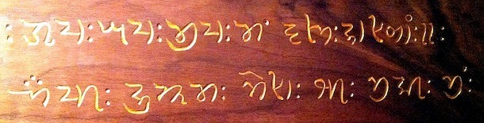

import ScriptDetails from '../../../../components/ScriptDetails.astro';
import WsList from '../../../../components/WsList.astro';
import ArticlesList from '../../../../components/ArticlesList.astro';
import SourcesList from '../../../../components/SourcesList.astro';
import Bibliography from '../../../../components/Bibliography.astro';

## Script details

<ScriptDetails />

## Script description

Khojki is a Brahmi-derived abugida related to the [Sharada](/scrlang/scripts/shrd) script.

Read the full description...
It is used by the Khoja people - an ethnic group of largely Ismaili Shia Muslims - for recording religious literature in the Sindhi language. Khojki has been used since at least the 16th century, originally for manuscripts, but later in printed form also. The script has also been used to write other South Asian languages; however, in recent years its use has declined markedly.

Khojki is structurally similar to other Brahmic scripts. Each of the forty-three characters represents either an independent vowel, or a consonant containing the inherent vowel [a]. In addition to these, there are eight dependent vowel diacritics. These can attach to a consonant character to replace the inherent vowel with a different one. Other word-forming characters include the _virama_, which is written after a consonant to silence the vowel entirely, the _nukta_, which can be written above either vowels or consonants to represent sounds not native to the Sindhi language, and the _shadda_ which represents [geminate](/reference/glossary#gemination) (long) consonants.

The script has never been standardized. In addition, it has been used by non-Sindhi speakers to represent other languages. These users have adapted the original phonetic values of some letters to fit the phonology of their own languages, resulting in inconsistency in how some sounds are represented. For example, there are two letters attested in different manuscripts as representing the dental aspirated sound [d̪h].

Khojki punctuation is largely borrowed from Latin. However, the _danda_ and _double danda_ are used to mark the end of a sentence, and a word separator is optionally used in between words.

## Languages that use this script

<WsList script='Khoj' wsMax='5' />

## Unicode status

In The Unicode Standard, Khojki script implementation is discussed in [Chapter 15: South and Central Asia-IV — Other Historic Scripts](https://www.unicode.org/versions/latest/core-spec/chapter-15/#G81423).

- [Full Unicode status for Khojki](/scrlang/unicode/khoj-unicode)

## Resources

<ArticlesList tag='script-khoj' header='Related articles' />

<SourcesList tag='script-khoj' header='External links' />

<Bibliography tag='script-khoj' header='Bibliography' />
