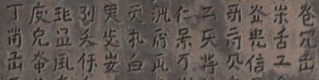

import ScriptDetails from '../../../../components/ScriptDetails.astro';
import WsList from '../../../../components/WsList.astro';
import ArticlesList from '../../../../components/ArticlesList.astro';
import SourcesList from '../../../../components/SourcesList.astro';
import Bibliography from '../../../../components/Bibliography.astro';

## Script details

<ScriptDetails />

## Script description

The Kitan (also called Liao) language, an extinct Mongolic language spoken in Northern China, was written using two mutually exclusive scripts, the Khitan Large script and the [Khitan Small script](/scrlang/scripts/kits).

Read the full description...
The Khitan Large script was created in 920 at the request of the Emperor Taizu. It was written in vertical columns using between 830-1000 characters. There is some debate as to whether the _Gu taishi mingshi ji_ inscription, which has been lost, was genuine or not. The controversy surrounding this inscription calls into question the reliability of about 170 characters.

Almost all attested examples of the script are in the form of inscriptions, with the exception of a manuscript book held at the Institute of Oriental Manuscripts of the Russian Academy of Sciences, Saint Petersburg.

Most Khitan Large characters were logograms, but ideograms and syllabograms may also have been used to fulfill grammatical functions. Some characters were based on Chinese characters but most were novel creations.

The Khitan Empire was destroyed in 1125 AD by the Jurchen, who continued to use the script until 1191 when it was suppressed by an imperial order.

Neither of the Khitan scripts has been fully deciphered.

## Languages that use this script

<WsList script='Kitl' wsMax='5' />

## Unicode status

- [Unicode status for Khitan Ideographs](/scrlang/unicode/z-khitan-ideographs-unicode)

## Resources

<ArticlesList tag='script-kitl' header='Related articles' />

<SourcesList tag='script-kitl' header='External links' />

<Bibliography tag='script-kitl' header='Bibliography' />

