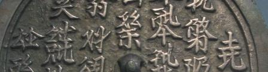

import ScriptDetails from '../../../../components/ScriptDetails.astro';
import ScriptResources from '../../../../components/ScriptResources.astro';
import WsList from '../../../../components/WsList.astro';

## Script details

<ScriptDetails />

## Script description

The Kitan (also called Liao) language, an extinct Mongolic language spoken in Northern China, was written using two mutually exclusive scripts, the Khitan Small script and the [Khitan Large script](/scrlang/scripts/kitl).

Read the full description...
The Khitan Small script was invented by a Kitan scholar known only as Diela, who was inspired by Uyghur writing. It was a mixed script. Phonetic elements were arranged in groups of one to seven to form rectangular phonographic blocks. (Some sources refer to these blocks as polygrams.) These represented the pronunciation of a word, and were used together with a small number of logographic characters that represented frequently used vocabulary. The shapes of some of the Khitan Small logographic characters are the same as some of the Khitan Large characters, but they do not have the same meanings.

Neither of the Khitan scripts has been fully deciphered.

## Languages that use this script

<WsList script='Kits' wsMax='5' />

## Unicode status

In The Unicode Standard, Khitan Small Script implementation is discussed in [Chapter 18: East Asia](https://www.unicode.org/versions/latest/core-spec/chapter-18/#G59285).

- [Full Unicode status for Khitan Small Script](/scrlang/unicode/kits-unicode)

## Resources

<ScriptResources detailSummary='seemore' />

