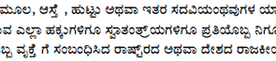
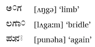
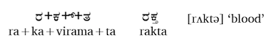

import ScriptDetails from '../../../../components/ScriptDetails.astro';
import WsList from '../../../../components/WsList.astro';
import ArticlesList from '../../../../components/ArticlesList.astro';
import SourcesList from '../../../../components/SourcesList.astro';
import BibList from '../../../../components/BibList.astro';

## Script details

<ScriptDetails />

## Script description

The Kannada script is used for writing the Kannada language spoken by over 35 million people in southern India.It is also used for writing Konkani, a South Indian language with over 3 million speakers, Tulu, with almost 2 million speakers, and a number of south Indian minority languages including Badaga, Kudiya and Paniya. The script is closely related to Telugu writing; both languages were written using the Old Kanarese script until the 1500s when it diverged into two distinct varieties. The script was standardized in the 19th century under the influence of Christian mission organizations, who established printing presses for printing books in the Kannada language.

Kannada letters are rounded in shape, typical of South Indian scripts. They are generally written with a headstroke running along the top, although this headstroke is not continuous throughout words as it is in Devanagari writing. The headstroke is omitted from letters followed by a long _a_, or a long or short _i_. There are forty-nine basic letters in the Kannada inventory. Of these, thirty-four are consonants, thirteen are vowels and two (_anusvara_ and _visarga_) are non-alphabetic symbols which will be described later.

The thirteen vowel letters are only used for writing vowels at the start of words. Vowels which follow a consonant are written using a different set of symbols. Each of the thirty-four consonant letters (called _aksaras_) represents a syllable containing the inherent vowel 'a'. Fourteen diacritic symbols can be used for changing this vowel; to represent the syllable [ku] for example, the letter _ka_ is written with the _u_ diacritic below it. Vowel diacritics can be written above, below or to the right of the aksara. To write a syllable-final consonant, that is, one which is not followed by a vowel, a _virama_ symbol is written above the letter to silence the inherent vowel.

The two additional symbols mentioned previously are only written after vowels. The first is _anusvara_, a circle which is often used to represent a nasal consonant pronounced at the same place in the oral cavity as the following consonant, as in the word [ʌŋgə] 'limb of the body', which is written with _anusvara_ following the [ʌ]. Where there is not following consonant, _anusvara_ represents a final [m], as in the word [lʌga:m] 'bridle', which is written with _anusvara_ following the [a:]. The second symbol is _visarga_, two small circles stacked in the manner of the dots in a Latin colon. This symbol is transcribed as ḥ and normally represents a post-vocalic [ha], as in the word 'again', written _punaḥ_ and pronounced [punəha].

The Kannada script employs a large number of ligatures, also called _conjuncts_, for writing consonant clusters. These are formed by reducing all but the first consonant in the cluster to an altered form and joining it below or to the right of the first consonant. A written syllable does not necessarily correspond to a phonological syllable where consonant clusters are concerned, for example the spoken word _rakta_ 'blood' would be syllabified _rak_+_ta_ but is written with the letters _ra_+_kta_.

There is a set of digits from 0-9 for writing numbers in the Kannada script.

## Languages that use this script

:::note
Languages listed as _unwritten_ would likely use Kannada script if a writing system were developed. A status of _obsolete_ indicates that the writing system is no longer in use for that language; the language may still be spoken.
:::

<WsList script='Knda' wsMax='5' />

## Unicode status

In The Unicode Standard, Kannada script implementation is discussed in [Chapter 12 South and Central Asia-I — Official Scripts of India](https://www.unicode.org/versions/latest/core-spec/chapter-12/#G38298).

- [Full Unicode status for Kannada](/scrlang/unicode/knda-unicode)

Other:

- [Unicode status for Vedic](/scrlang/unicode/x-vedic-unicode)

## Resources

<ArticlesList tag='script-knda' header='Related articles' />

<SourcesList tag='script-knda' header='External links' entrytype='non-online' />

<BibList tag='script-knda' header='Bibliography' entrytype='non-online' />

