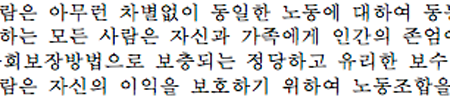

import ScriptDetails from '../../../../components/ScriptDetails.astro';
import ScriptResources from '../../../../components/ScriptResources.astro';
import WsList from '../../../../components/WsList.astro';

## Script details

<ScriptDetails />

## Script description

The Korean language is often written using a combination of a language-specific script, called _Hangul_, and Chinese Han characters, called _hanja_ in Korean.

Read the full description...
Hangul is a complete orthography; anything that can be said in Korean can be written in Hangul, but there are cultural and historical reasons for the use of hanja. The form of writing which combines both scripts is sometimes called Korean mixed script.

Until 1446, Korean had been written exclusively in Chinese characters, but this script was not well-suited to the language. A given Chinese character could be used to represent a spoken Korean syllable, irrespective of its original Chinese meaning, or it could be used to represent the Korean word with the closest meaning to its original. Reading was difficult because the intended function of the character was not always apparent. In 1446 King Sejong designed the phonetic Hangul script to be perfectly suited for writing Korean, to make literacy available to everyone. Initially, Hangul met with some resistance from scholars, and it was not until the 19th century, when Christian missionaries began teaching it, that it really began to be widely established. By about 1950, Hangul and hanja were being mixed fairly evenly, at least in the South, and hanja has been in decline ever since. Hangul is now Korea's national script, although it is still not used exclusively.

The Hangul script is written using 51 letters, called _jamo_, which are arranged into syllable blocks by modifying the size, shape or position of each jamo to reflect its position in the spoken syllable. Hangul syllable blocks were designed to conform with the square frame of Chinese characters, and, like Chinese characters, can be written in vertical or horizontal lines.

A small number of hanja characters have been modified to be unique to Korean writing, but generally they are identical to traditional Han characters.

Spoken Korean vocabulary consists of native Korean words, Sino-Korean words (that is, words influenced by having been written in hanja or imported from Chinese), and loan words from other foreign languages, mainly English. Sino-Korean words make up a little over half of the South Korean vocabulary, although many of these words have been replaced by native Korean words in the North. Hanja is not used for writing native Korean words nor, generally, for writing other loan words; where it is used, it is used for writing Sino-Korean words only.

The role of hanja is different in the North and in the South of the country. After the division of Korea at the end of the second world war, North Korea officially abolished the use of hanja in any printed publications, but schoolchildren there are still taught 2-3,000 characters. Hanja are not used in literature in the North, but are sometimes used for decorative purposes such as at athletic events and cultural parades, or on packaging. In the South, children do not begin learning hanja until the seventh year of school, and are taught only 1,800 characters. The script is primarily used for academic literature in the South, often to clarify words with an ambiguous meaning, and for decorative purposes such as the name of a newspaper.

## Languages that use this script

<WsList script='Kore' wsMax='5' />

## Unicode status

- [Unicode status for Hangul](/scrlang/unicode/hang-unicode)
- [Unicode status for Han](/scrlang/unicode/hani-unicode)

Other:

- [Unicode status for Currency](/scrlang/unicode/x-currency-unicode)

## Resources

<ScriptResources detailSummary='seemore' />

