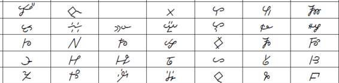

import ScriptDetails from '../../../../components/ScriptDetails.astro';
import ScriptResources from '../../../../components/ScriptResources.astro';
import WsList from '../../../../components/WsList.astro';

## Script details

<ScriptDetails />

## Script description

The Kpelle script was created by Chief Gbili, from the town of Sanoyie in Liberia, for writing the Kpelle language.

Read the full description...
It was used in the 1930s and early 1940s around Gbili’s local area for sending messages, keeping tax and store records, and recording legal debts, but by the late 1940s had been replaced by the Latin script.

Kpelle writing uses 88 symbols, each representing a pair of syllables dubbed ‘mutational pairs’ by the linguist David Dalby. These pairs are related by the phonological similarity of their initial consonants or consonant clusters. For example, the syllables _kpi_ and _gbi_ are identical except in voicing, and are represented by a single symbol. Some pairs are written with two symbols, for example, _ti_ and _di_, but either symbol can be used for either sound.

The script is written from left to right, without the use of punctuation. Numbers from 1-10 can be written, but there is no symbol for writing the number zero.

## Languages that use this script

<WsList script='Kpel' wsMax='5' />

## Unicode status

The Kpelle script is not yet in Unicode. The script has a tentative allocation at U+16C00..U+16C7F in the [Roadmap to the SMP](http://www.unicode.org/roadmaps/smp/) for the Unicode Standard.

- [Full Unicode status for Kpelle](/scrlang/unicode/kpel-unicode)

## Resources

<ScriptResources detailSummary='seemore' />

