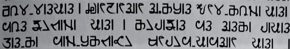

import ScriptDetails from '../../../../components/ScriptDetails.astro';
import WsList from '../../../../components/WsList.astro';
import ArticlesList from '../../../../components/ArticlesList.astro';
import SourceLinksList from '../../../../components/SourceLinksList.astro';
import BibList from '../../../../components/BibList.astro';

## Script details

<ScriptDetails />

## Script description

The Kirat Rai script is an abugida used for writing Bantawa, an eastern Kiranti language of the Sino-Tibetan family.

Read the full description...
Bantawa is spoken in Sikkim and Nepal by almost 400,000 people. The script appears to be a modification of Khambu Rai, which was previously used for writing the same language.

Kirat Rai is written with thirty-one consonant letters each containing an inherent /a/ vowel, seven vowel diacritics for changing the inherent vowel, a virama for cancelling the inherent vowel, and a vowel carrier which can be used in combination with the vowel diacritics for writing word-initial vowels.

## Languages that use this script

<WsList script='Krai' wsMax='5' />

## Unicode status

In The Unicode Standard, Kirat Rai Script implementation is discussed in [Chapter 13 South and Central Asia-II — Other Modern Scripts](https://www.unicode.org/versions/latest/core-spec/chapter-13/#G746340).

- [Full Unicode status for Kirat Rai](/scrlang/unicode/krai-unicode)

Other:

- [Unicode status for Khambu Rai](/scrlang/unicode/z-khambu-rai-unicode)

## Resources

<ArticlesList tag='script-krai' header='Related articles' />

<SourceLinksList tag='script-krai' header='External links' entrytype='online' />

<BibList tag='script-krai' header='Bibliography' entrytype='non-online' />

