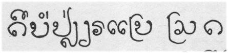
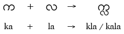
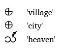
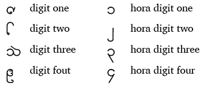

import ScriptDetails from '../../../../components/ScriptDetails.astro';
import ScriptResources from '../../../../components/ScriptResources.astro';
import WsList from '../../../../components/WsList.astro';

## Script details

<ScriptDetails />

## Script description

The Lanna script is also known as the Tai Tham, Dham, Yuan, or Northern Thai script.

Read the full description...
It has been used for writing the Northern Thai, Lü and Khün languages. Northern Thai is the biggest language group which uses the script, with 6million speakers, but literacy is low. Lü is now written in the [New Tai Lue](/scrlang/scripts/talu) script, although some speakers born before 1950 are still literate in Lanna. The script has religious significance and is used in Buddhist monasteries.

Consonants bear an inherent [a] vowel, which can be modified using dependent vowel symbols which are joined to the consonant. Combinations of dependent vowels are used to represent glides and diphthongs. Some basic vowels are represented by [digraphs](/reference/glossary#multig), that is, the symbol used to represent them consists of more than one component. There are also eight independent vowel symbols which are used at the start of a syllable. Some vowels are used only for specific languages.

Most consonants take two forms: a full form and a combining form. The combining form tends to be smaller and is written below or alongside a full consonant. The Lanna script is unusual in that joining a full and a combining consonant does not necessarily produce a consonant cluster; the inherent vowel in the first consonant may still be present. 

A combining consonant can also join to a dependent vowel in a closed syllable, or to represent the first consonant of the following syllable. In these cases, it is often down to the preference of the writer whether the full or the subjoined form of a consonant is used. Hence, there are different ways of spelling many words.

In addition, there are seven dependent consonant symbols which are used at the end of a syllable or to form consonant clusters. Some of these are specific to particular languages.

There are three classes of consonants, which helps to indicate the tone of a syllable. Vowel length also partly determines tone. In addition, various language-specific tone marks are used to further represent tone.

Four script-specific punctuation marks are used, in combination with Latin punctuation. Other non-alphabetic symbols are used to mark the beginning and end of sections of text. There are also three logographs representing 'village', 'city' and 'heaven'. 

Lanna has two sets of digits, representing the numbers 0-9. One of these is used largely for religious purposes; the other is in common use. It is speculated that the common set, called hora, was historically used for astrological purposes, 'hora' being name of one of the main branches of Vedic astrology. Numbers 1-4 in  each system are shown below.

## Languages that use this script

:::note
Languages listed as _unwritten_ would likely use Tai Tham script if a writing system were developed. A status of _obsolete_ indicates that the writing system is no longer in use for that language; the language may still be spoken.
:::

<WsList script='Lana' wsMax='5' />

## Unicode status

In The Unicode Standard, Tai Tham script implementation is discussed in [Chapter 16 Southeast Asia](http://www.unicode.org/versions/latest/ch16.pdf).

- [Full Unicode status for Tai Tham](/scrlang/unicode/lana-unicode)

## Resources

<ScriptResources detailSummary='seemore' />

