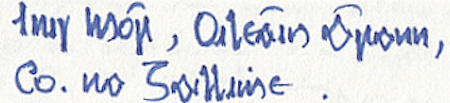

import ScriptDetails from '../../../../components/ScriptDetails.astro';
import ScriptResources from '../../../../components/ScriptResources.astro';
import WsList from '../../../../components/WsList.astro';

## Script details

<ScriptDetails />

## Script description

The Gaelic variant of the Latin script was used between the 16th and 20th centuries for writing Irish.

Read the full description...
Modern and digital forms of the script are based on traditional hand-written manuscript styles.

There are a number of typefaces subsumed under the term ‘Gaelic type’. Michael Everson identifies over 100 Gaelic typefaces dating from 1567 to the present. All Gaelic typefaces include the twenty-six letters of the Latin alphabet, plus the accented vowels and dotted consonants used for writing Irish, and the Tironian sign [_et_](https://scriptsource.org/char/U00204A), which represents the Irish word _agus_, meaning “and”. Archaic ligatures are also sometimes included.

Gaelic type is now largely restricted to decorative contexts. Modern Irish is written using the following Latin letters:

a á b c d e é f g h i í l m n o ó p r s t u ú 
j k q v w x y z (for loanwords only)

More information can be found [here](https://scriptsource.org/ws/ga/sym).

## Languages that use this script

<WsList script='Latg' wsMax='5' />

## Unicode status

Unicode largely treats the Gaelic script as a font variant of the Latin alphabet. However, some letters are encoded separately:

- [Full Unicode status for Gaelic](/scrlang/unicode/latg-unicode)

## Resources

<ScriptResources detailSummary='seemore' />

