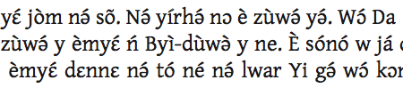

import ScriptDetails from '../../../../components/ScriptDetails.astro';
import WsList from '../../../../components/WsList.astro';
import ArticlesList from '../../../../components/ArticlesList.astro';
import SourcesList from '../../../../components/SourcesList.astro';
import Bibliography from '../../../../components/Bibliography.astro';

## Script details

<ScriptDetails />

## Script description

The Latin script (also called the Roman script) is the most widely used writing system in the world, being the script of the English language, spoken by over 300,000,000 people worldwide.

Read the full description...
It is also the script used for writing a number of Romance, Germanic, Baltic and non-Indo-European languages, as well as the [International Phonetic Alphabet (IPA)](https://scriptsource.org/entry/ucgb77fkvh).

The script was derived from the Western variant of the Greek alphabet. The earliest extant inscription, an engraved brooch now in the ‘Museo Nazionale Preistorico Etnografico Luigi Pigorini’ in Rome, has been dated to the 7th century BC. The script developed slowly over the next thousand years, and by the 4th century AD many of the modern forms had been developed, and writing had settled into a consistent left to right direction. The Latin script was disseminated throughout western, northern and central Europe and the Baltic countries along with the Christian religion. However it was not until the colonization of the Americas, Australia, and parts of Asia, Africa and the Pacific that the script began to spread outside of Europe, carried by the English, Spanish, Portuguese, French, and Dutch languages.

As the script spread around the world, a number of language-specific amendments were made in order to accurately represent the sounds of various languages. These included ligatures, for example the German _esszett_ ß, and a number of diacritics. Some languages also adapted the alphabet by the addition of entirely new letters, such as _eth_ Ðð used in Faroese and Icelandic or _epsilon_ Ɛɛ used in many Niger-Congo orthographies.

The Latin script is bicameral; it is written using both upper- and lower-case letters. It is written horizontally from left to right. Each letter sits on the baseline, with some letters having descenders hanging below the baseline, and some having ascenders protruding beyond the x-height. The script also uses a set of punctuation, which is almost entirely consistent across European languages. Exceptions to this include different syles of quotation marks (“ ” and « »), the Greek question mark, which is identical to the semicolon in many other languages (;), and the Spanish inverted question/exclamation marks (¿ and ¡).

Digits from 0-9 are used. These can be combined to represent larger numbers.

## Languages that use this script

:::note
Languages listed as _unwritten_ would likely use Latin script if a writing system were developed. A status of _obsolete_ indicates that the writing system is no longer in use for that language; the language may still be spoken.
:::

<WsList script='Latn' wsMax='5' />

## Unicode status

In The Unicode Standard, Latin script implementation is discussed in [Chapter 7 Europe-I — Modern and Liturgical Scripts](https://www.unicode.org/versions/latest/core-spec/chapter-7/#G4321), [UTN 26: On the Encoding of Latin, Greek, Cyrillic, and Han](https://www.unicode.org/notes/tn26/), &lt;br /&gt; 
[UTN 29: The Use of Phonetic and Other Symbols in Dictionaries: A Brief Survey](https://www.unicode.org/notes/tn29/), and in [UTN 44: Medieval Latin Character Recommendations](https://www.unicode.org/notes/tn44/).

- [Full Unicode status for Latin](/scrlang/unicode/latn-unicode)

Other:

- [Unicode status for Modifier letters](/scrlang/unicode/x-mod-letters-unicode)
- [Unicode status for General Punctuation](/scrlang/unicode/x-gen-punct-unicode)
- [Unicode status for Currency](/scrlang/unicode/x-currency-unicode)
- [Unicode status for Combining marks](/scrlang/unicode/x-comb-marks-unicode)

## Resources

<ArticlesList tag='script-latn' header='Related articles' />

<SourcesList tag='script-latn' header='External links' />

<Bibliography tag='script-latn' header='Bibliography' />

