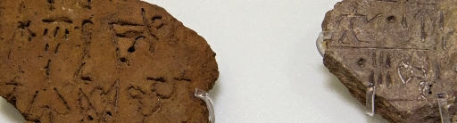

import ScriptDetails from '../../../../components/ScriptDetails.astro';
import WsList from '../../../../components/WsList.astro';
import ArticlesList from '../../../../components/ArticlesList.astro';
import SourcesList from '../../../../components/SourcesList.astro';
import BibList from '../../../../components/BibList.astro';

## Script details

<ScriptDetails />

## Script description

Linear A is an undeciphered syllabary used between 1800-1450 BC in ancient Crete, alongside Cretan Hieroglyphs.

Read the full description...
Linear A was the official script for the palaces and cults, and Cretan Hieroglyphs were used for seals. Cretan Hieroglyphs had been in use for some time before the development of Linear A, and it is thought that the Linear A symbols may have derived from the shapes of some of the hieroglyphs.

It is not known what language the script represents. Some symbols are shared by Linear A and Linear B (which has been deciphered), but assigning the same symbol-sound associations to both scripts produces words written in Linear A  which are not related to any currently known language. It is suggested that the script was used for writing an ancient language of which we have no other record; this language has been dubbed Minoan, and is thought to belong to the Indo-Iranian language family. Other theories suggest that the script was used for writing a variant of Greek or pre-Greek, or Luwian.

Linear A was most commonly inscribed on clay tablets, possibly for the purpose of recording merchants’ transactions. The script was written from left to right. Of the 120 syllables, half are thought to represent phonetic syllables and half are thought to be logographs representing objects or concepts.

## Languages that use this script

:::note
A status of _obsolete_ indicates that the writing system is no longer in use for that language; the language may still be spoken.
:::

<WsList script='Lina' wsMax='5' />

## Unicode status

In The Unicode Standard, Linear A implementation is discussed in [Chapter 8 Europe-II — Ancient and Other Scripts](https://www.unicode.org/versions/latest/core-spec/chapter-8/#G27575).

- [Full Unicode status for Linear A](/scrlang/unicode/lina-unicode)

## Resources

<ArticlesList tag='script-lina' header='Related articles' />

<SourcesList tag='script-lina' header='External links' entrytype='non-online' />

<BibList tag='script-lina' header='Bibliography' entrytype='non-online' />

