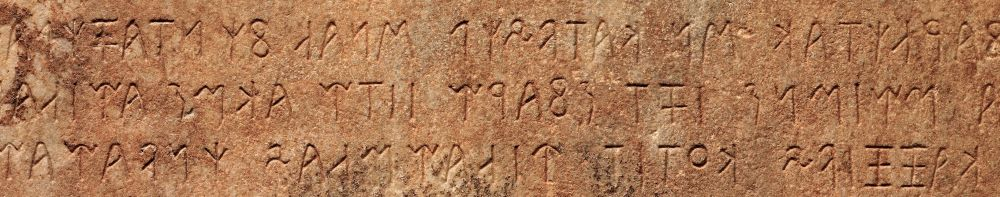

import ScriptDetails from '../../../../components/ScriptDetails.astro';
import WsList from '../../../../components/WsList.astro';
import ArticlesList from '../../../../components/ArticlesList.astro';
import SourcesList from '../../../../components/SourcesList.astro';
import Bibliography from '../../../../components/Bibliography.astro';

## Script details

<ScriptDetails />

## Script description

The Lydian script was used between 700 and 200 BC for writing the Lydian language, an ancient Indo-European language spoken in the modern-day Turkish provinces of Manisa and inland İzmir.

The Lydian script was an alphabet based on the Eastern Greek alphabet, although visually similar letters do not necessarily represent the same sounds in both scripts.

Read the full description...
Twenty-six sounds were represented in the script, some by more than one letter.

Early examples of Lydian writing are written both from left to right and from right to left. One is written in [boustrophedon](/reference/glossary#boust) style. Later texts were written exclusively from right to left. Words were generally separated by spaces, although there is one text in which words are separated by dots.

## Languages that use this script

<WsList script='Lydi' wsMax='5' />

## Unicode status

In The Unicode Standard, Lydian script implementation is discussed in [Chapter 8 Europe-II — Ancient and Other Scripts](https://www.unicode.org/versions/latest/core-spec/chapter-8/#G26511).

- [Full Unicode status for Lydian](/scrlang/unicode/lydi-unicode)

## Resources

<ArticlesList tag='script-lydi' header='Related articles' />

<SourcesList tag='script-lydi' header='External links' />

<Bibliography tag='script-lydi' header='Bibliography' />

