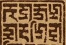

import ScriptDetails from '../../../../components/ScriptDetails.astro';
import WsList from '../../../../components/WsList.astro';
import ArticlesList from '../../../../components/ArticlesList.astro';
import SourceLinksList from '../../../../components/SourceLinksList.astro';
import BibList from '../../../../components/BibList.astro';

## Script details

<ScriptDetails />

## Script description

Marchen, also called the Greater Mar or the Greater Beautiful script, is one of a group of related scripts used in the Tibetan Bön religion.

Read the full description...
It is used for writing the Zhang-zhung language, now preserved only in Bön literature, and occasionally for writing Tibetan. This script is not to be confused with the _Marchung_ script, a related but separate script about which little is known beyond that it has been used in some other Bön texts.

Marchen writing employs similar principles to [Tibetan](/scrlang/scripts/tibt); each consonant has a base form and a subjoined form which can be combined in vertical stacks to represent consonant clusters. There are also five vowel signs which can be attached to a base consonant or to a consonant stack; in the absence of one of these signs, consonants have an inherent /a/ vowel.

## Languages that use this script

<WsList script='Marc' wsMax='5' />

## Unicode status

In The Unicode Standard, Marchen script implementation is discussed in [Chapter 14: South and Central Asia-III — Ancient Scripts](https://www.unicode.org/versions/latest/core-spec/chapter-14/#G38187).

- [Full Unicode status for Marchen](/scrlang/unicode/marc-unicode)

## Resources

<ArticlesList tag='script-marc' header='Related articles' />

<SourceLinksList tag='script-marc' header='External links' entrytype='online' />

<BibList tag='script-marc' header='Bibliography' entrytype='non-online' />

