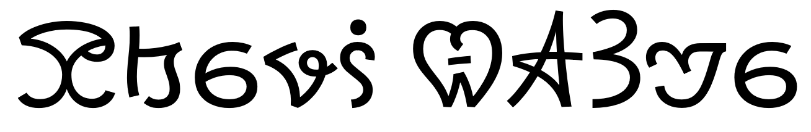

import ScriptDetails from '../../../../components/ScriptDetails.astro';
import WsList from '../../../../components/WsList.astro';
import ArticlesList from '../../../../components/ArticlesList.astro';
import SourceLinksList from '../../../../components/SourceLinksList.astro';
import BibList from '../../../../components/BibList.astro';
import Attribution from '/src/components/Attribution.astro';
import CaptionText from '/src/components/CaptionText.astro';

<CaptionText text="Sample of Medefaidrin (Noto Sans font)"/>
<Attribution
    type="Image"
    copyholder=""
    copyurl=""
    copyyears="2022"
    license="CC0 1.0"
    licenseurl="https://creativecommons.org/publicdomain/zero/1.0/deed.en"
    author="Immanuel Giel"
    source="Wikimedia"
    sourceurl="https://commons.wikimedia.org/wiki/File:Medefaidrin.png"
/>

## Script details

<ScriptDetails />

## Script description

Medefaidrin is a script created for the Medefaidrin language, an artificial language used by the Oberi Okaime church, an indigenous Christian church located in the Cross-River State of Nigeria.

Read the full description...
Presently, the religious community numbers 4000 members of whom up to 20 are fluent in the language. The script employs alphabetic cased forms similar to English, with special characters for the first-person pronoun and the conjunction 'or'. A [vigesimal](/reference/glossary#vigesimala) numeral system is employed, with special contextual forms for 1, 2, and 3 when combined with other digits.

## Languages that use this script

<WsList script='Medf' wsMax='5' />

## Unicode status

In The Unicode Standard, Medefaidrin (also called Oberi Okaime script) script implementation is discussed in [Chapter 19:Africa](https://www.unicode.org/versions/latest/core-spec/chapter-19/#G58353).

- [Full Unicode status for Medefaidrin](/scrlang/unicode/medf-unicode)

## Resources

<ArticlesList tag='script-medf' header='Related articles' />

<SourceLinksList tag='script-medf' header='External links' entrytype='online' />

<BibList tag='script-medf' header='Bibliography' entrytype='non-online' />
