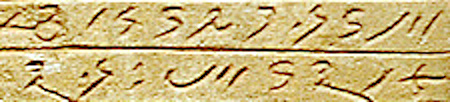

import ScriptDetails from '../../../../components/ScriptDetails.astro';
import ScriptResources from '../../../../components/ScriptResources.astro';
import WsList from '../../../../components/WsList.astro';

## Script details

<ScriptDetails />

## Script description

The Meroitic (also Meroïtic) script was created in the 3rd century BC in the ancient Kush (also called Meroë) civilization in modern-day Sudan, where it was used to write the Meroitic language.

Read the full description...
In the 6th century AD, with the arrival of Christianity to the area, the script was supplanted by Coptic.

There were two forms of the Meroitic script; a hieroglyphic form derived from Egyptian hieroglyphs and a cursive form derived from Demotic Egyptian. The majority of extant texts are written in the cursive script.

The script has been deciphered to the point that many texts can be read, but the content not understood, as the language itself is no longer used and little is known about it.

Cursive Meroitic was written from right to left. There were fifteen signs for representing consonants, each inherently having the following vowel [a]. There were also three vowel letters, as well as a letter for representing an initial [a] sound, and four letters for writing the syllables [ne], [se], [te] and [to]. Some final consonants, including [s] and [n], were not written.

Cursive Meroitic was one of very few scripts from that era which made use of a word separator symbol. This symbol appeared as two dots stacked one on top of the other.

## Languages that use this script

<WsList script='Merc' wsMax='5' />

## Unicode status

In The Unicode Standard, Meroitic Cursive script implementation is discussed in [Chapter 11 Cuneiform and Hieroglyphs](https://www.unicode.org/versions/latest/core-spec/chapter-11/#G25005).

- [Full Unicode status for Meroitic Cursive](/scrlang/unicode/merc-unicode)

## Resources

<ScriptResources detailSummary='seemore' />

