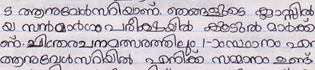

import ScriptDetails from '../../../../components/ScriptDetails.astro';
import ScriptResources from '../../../../components/ScriptResources.astro';
import WsList from '../../../../components/WsList.astro';

## Script details

<ScriptDetails />

## Script description

The Malayalam script is used for writing the Malayalam language, the official language of the Indian state of Kerala, and a number of minority languages spoken in India.

Read the full description...
Until the 16th century Malayalam was written in the _vattezhuthu_ script, a Brahmic script which developed alongside Grantha writing, from which the modern Malayalam script descended.

Malayalam is written from left to right. There are fifty-three letters, called _akṣaras_; thirty-seven of these represent full syllables consisting of a consonant and the vowel [a], and sixteen represent independent vowels. Independent vowel letters are only used where a vowel appears at the beginning of a word. Vowels which follow a consonant are written with a diacritic above, below, to the left or right of, or flanking either side of the consonant letter. So an unmarked letter _k_ represents the syllable [ka], but the letter _k_ written with the _e_ diacritic (a spiral to the left) represents the syllable [ke]. There are two vowels for which the diacritics are quite complex; [u] and [u:] are normally written with a small circle or looped circle below the letter, but can be written with one of eight other diacritics when following particular consonants. The script also contains a subset of letters called _cillakṣarams_ 'letter fragments' for representing sonorants followed by a pause, for example (but not necessarily) at the end of a word.

Spaces are often used between words, but it is not uncommon for writers to use spacing to indicate phonological pauses, rather than lexical boundaries. 

When multiple consonants are used as a cluster within a word, that is, with no vowel between them, they are traditionally written with special conjunct letters. Malayalam is known for its large number of conjuncts, which are also used for writing [geminate](/reference/glossary#gemination) (long) consonants. Conjuncts take several forms; the most common are decomposable left-to-right ligatures, but some combinations stack vertically. Some conjuncts are not so easily decomposable as one or both letters change shape when in a cluster. The letters _y_, _r_ and _v_ are all written as diacritics when they follow a consonant. The letter _l_ also takes a different form when it is the second member in a consonant cluster.

To reduce the complexity associated with writing these conjuncts, an orthography reform was implemented in the 1970s which recommended the replacement of a large number of irregular conjuncts with a predictable sequence of individual letters using a _virama_ symbol to delete the vowel inherent in all but the last consonant in the sequence. Many vowel diacritics were also redesigned so they could be written as spacing letters next to the consonant they modify. However, these changes were implemented inconsistently so that modern writing uses a mixture of traditional and reformed letters, even within the same text.

## Languages that use this script

:::note
Languages listed as _unwritten_ would likely use Malayalam script if a writing system were developed. 
:::

<WsList script='Mlym' wsMax='5' />

## Unicode status

In The Unicode Standard, Malayalam script implementation is discussed in [Chapter 12 South and Central Asia-I: Official Scripts of India](http://www.unicode.org/versions/latest/ch12.pdf).

- [Full Unicode status for Malayalam](/scrlang/unicode/mlym-unicode)

Other:

- [Unicode status for Vedic](/scrlang/unicode/x-vedic-unicode)

## Resources

<ScriptResources detailSummary='seemore' />

