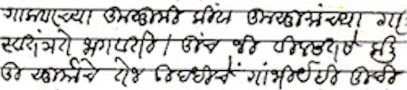

import ScriptDetails from '../../../../components/ScriptDetails.astro';
import ScriptResources from '../../../../components/ScriptResources.astro';
import WsList from '../../../../components/WsList.astro';

## Script details

<ScriptDetails />

## Script description

The Modi script was used from the 17th century until the 1950s for writing Marathi, the state language of the Indian state of Maharashtra.

Read the full description...
The script developed from a cursive form of [Devanagari](/scrlang/scripts/deva), so shares a number of features with, and is visually similar to, that script. Modi is an abugida written using thirty-three consonant letters, each bearing the inherent vowel /a/. This vowel can be changed by appending one of seven vowel diacritics to the consonant, or silenced by appending a _virama_ below the consonant. Vowels which are not preceded by a consonant are written with one of eight independent vowel letters.

Modi is considered by many to be extinct, having been replaced by Devanagari after the 1950s, although Daniels and Bright (1996) report limited use for personal correspondence. Efforts are underway to preserve knowledge of the script before the last generation of frequent users dies.

## Languages that use this script

<WsList script='Modi' wsMax='5' />

## Unicode status

In The Unicode Standard, Modi script implementation is discussed in [Chapter 15 South and Central Asia-IV — Other Historic Scripts](https://www.unicode.org/versions/latest/core-spec/chapter-15/#G80897).

- [Full Unicode status for Modi](/scrlang/unicode/modi-unicode)

## Resources

<ScriptResources detailSummary='seemore' />

