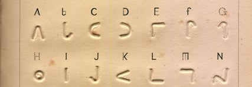

import ScriptDetails from '../../../../components/ScriptDetails.astro';
import ScriptResources from '../../../../components/ScriptResources.astro';
import WsList from '../../../../components/WsList.astro';

## Script details

<ScriptDetails />

## Script description

The Moon script was created in the mid-1800s by William Moon, a blind man living in England, after he became frustrated with the other embossed scripts which were used at the time.

Read the full description...
Moon became blind as an adult, having already learned to read as a child, and most modern users of the script are also those who have become blind after learning to read printed text and are familiar with the shapes of letters.

The script consists of raised curves and lines, based on the shapes of the Latin alphabet. Nine basic shapes are rotated to various orientations to produce twenty-six letters. There are also symbols to represent the words _and_ and _the_, and eight punctuation marks.

Moon type is not as widely used as Braille, and never became popular outside of the UK. The script is typed using a Moon Writer, which resembles a typewriter but uses a pressure pad to emboss the shapes of letters onto the paper.

## Languages that use this script

<WsList script='Moon' wsMax='5' />

## Unicode status

The Moon script is not yet in Unicode. The script has a tentative allocation at U+161A0..U+161FF in the [Roadmap to the SMP](http://www.unicode.org/roadmaps/smp/) for the Unicode Standard.

- [Full Unicode status for Moon](/scrlang/unicode/moon-unicode)

## Resources

<ScriptResources detailSummary='seemore' />

