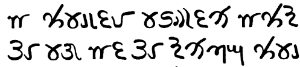

import ScriptDetails from '../../../../components/ScriptDetails.astro';
import ScriptResources from '../../../../components/ScriptResources.astro';
import WsList from '../../../../components/WsList.astro';

## Script details

<ScriptDetails />

## Script description

The Multani script was used from the 18th to the early 20th century for writing the Saraiki language, spoken in the Punjab regions of India and Pakistan, and in northern Sindh in Pakistan.

Read the full description...
It was a commercial script, used mainly by merchants. Structurally, the script has characteristics of an abjad; vowels are generally not written unless they appear at the start of a word or in one-syllable V or CV clusters.

## Languages that use this script

:::note
A status of _obsolete_ indicates that the writing system is no longer in use for that language; the language may still be spoken.
:::

<WsList script='Mult' wsMax='5' />

## Unicode status

In The Unicode Standard, Multani script implementation is discussed in [Chapter 15 South and Central Asia-IV: Other Historic Scripts](http://www.unicode.org/versions/latest/ch15.pdf).

- [Full Unicode status for Multani](/scrlang/unicode/mult-unicode)

## Resources

<ScriptResources detailSummary='seemore' />

