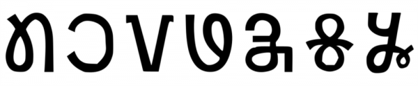

import ScriptDetails from '../../../../components/ScriptDetails.astro';
import WsList from '../../../../components/WsList.astro';
import ArticlesList from '../../../../components/ArticlesList.astro';
import SourcesList from '../../../../components/SourcesList.astro';
import BibList from '../../../../components/BibList.astro';

## Script details

<ScriptDetails />

## Script description

The Nag Mundari script has sometimes been called _Mundari Bani script_.

Read the full description...
It has been used for writing the Mundari language of India. The script was invented by Rohidas Singh Nag in the latter half of the 20th century.

The script has 27 letters, 5 "tong" (a collection of symbols and diacritics), and script specific digits. European-style punctuation is used.

## Languages that use this script

<WsList script='Nagm' wsMax='5' />

## Unicode status

In The Unicode Standard, Nag Mundari script implementation is discussed in [Chapter 13: South and Central Asia-II — Other Modern Scripts](https://www.unicode.org/versions/latest/core-spec/chapter-13/#G112439).

- [Full Unicode status for Nag Mundari](/scrlang/unicode/nagm-unicode)

## Resources

<ArticlesList tag='script-nagm' header='Related articles' />

<SourcesList tag='script-nagm' header='External links' entrytype='non-online' />

<BibList tag='script-nagm' header='Bibliography' entrytype='non-online' />

