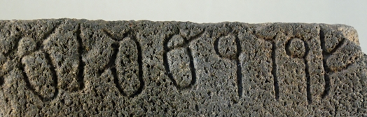

import ScriptDetails from '../../../../components/ScriptDetails.astro';
import WsList from '../../../../components/WsList.astro';
import ArticlesList from '../../../../components/ArticlesList.astro';
import SourcesList from '../../../../components/SourcesList.astro';
import BibList from '../../../../components/BibList.astro';

## Script details

<ScriptDetails />

## Script description

The Nabataean script was used from the 2nd century BC until the 4th or 5th century AD for writing the Nabataean language, a Northwest Semitic language closely related to Arabic.

Read the full description...
The script was developed from Aramaic writing, and was the immediate precursor of Arabic writing.

Nabataean was a right-to-left abjad; each letter represented a consonant and the reader had to supply the vowels from the context. It was a cursive script which made extensive use of ligatures. The script was used over a wide geographic area, and letter shapes were highly diverse from one region to another.

## Languages that use this script

<WsList script='Nbat' wsMax='5' />

## Unicode status

In The Unicode Standard, Nabataean script implementation is discussed in [Chapter 10 Middle East-II — Ancient Scripts](https://www.unicode.org/versions/latest/core-spec/chapter-10/#G29596).

- [Full Unicode status for Nabataean](/scrlang/unicode/nbat-unicode)

## Resources

<ArticlesList tag='script-nbat' header='Related articles' />

<SourcesList tag='script-nbat' header='External links' entrytype='non-online' />

<BibList tag='script-nbat' header='Bibliography' entrytype='non-online' />

