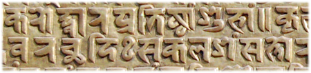

import ScriptDetails from '../../../../components/ScriptDetails.astro';
import ScriptResources from '../../../../components/ScriptResources.astro';
import WsList from '../../../../components/WsList.astro';

## Script details

<ScriptDetails />

## Script description

The Newa script, also known as Newar, or Prachalit (meaning popular), is used primarily for writing Newari, a Tibeto-Burman language of Nepal (also called Nepal-Bhasha, literally 'Nepal-Language', but not to be confused with Nepali).

Read the full description...
This script has also been used, extensively in some cases, for writing the [Sanskrit](https://scriptsource.org/ws/sa-Qabc), [Nepali](https://scriptsource.org/ws/ne-Qabc), [Hindi](https://scriptsource.org/ws/hi-Qabc), [Bengali](https://scriptsource.org/ws/bn-Qabc), and [Maithili](https://scriptsource.org/ws/mai-Qabc) languages. The script is also known as Nepalakshar, Newah Akhah and Pachumol. It is one of six scripts subsumed under the name Nepal-Lipi, literally 'Nepal-Script', though it is not to be confused with Devanagari, which is the script normally used for writing Nepali.

Previously, along with Newa, the Ranjana, Bhujimol, Kutila, Golmol, and Litumol scripts were used for writing Newari. Use of these scripts began to decline after the Gorkhali conquest of the Kathmandu valley in 1769, and they are now rarely used. Of the six, Newa and Ranjana are the best known, although even these are not commonly used and most young Newari speakers cannot read them. 

The Newa script is derived from Brahmi and is an abugida written from left to right. There are two main varieties of Newa writing; flat-headed and curve-headed. It is closely related to Devanagari, and many of the letter shapes are similar to their Devanagari equivalents. The script employs a set of digits from 0-9, many of which also look similar to the Devanagari numbers.

There are thirty-six consonants, each representing a consonant+vowel syllable. The default vowel is [a/ə] but this can be changed by attaching one of ten vowel diacritics to the letter. Initial vowels, that is, those which are not preceded by a consonant to which they can attach, are written using independent vowel letters. Two diacritics representing nasalization of a vowel can also be attached to independent vowel letters, to consonant letters (in which case the inherent vowel is nasalized), or to consonant+vowel diacritic combinations. These diacritics are called _anusvara_ and _candrabindu_. There is also a diacritic called _visarga_ which represents a voiceless [h] after a vowel. These diacritics look similar but not identical to the symbols of the same names used by a number of other Brahmic scripts.

## Languages that use this script

:::note
A status of _obsolete_ indicates that the writing system is no longer in use for that language; the language may still be spoken.
:::

<WsList script='Newa' wsMax='5' />

## Unicode status

- [Unicode status for Bhujinmol](/scrlang/unicode/qa74-unicode)
- [Unicode status for Newa](/scrlang/unicode/newa-unicode)
Other:

- [Unicode status for Vedic](/scrlang/unicode/x-vedic-unicode)
- [Unicode status for Combining marks](/scrlang/unicode/x-comb-marks-unicode)

## Resources

<ScriptResources detailSummary='seemore' />

