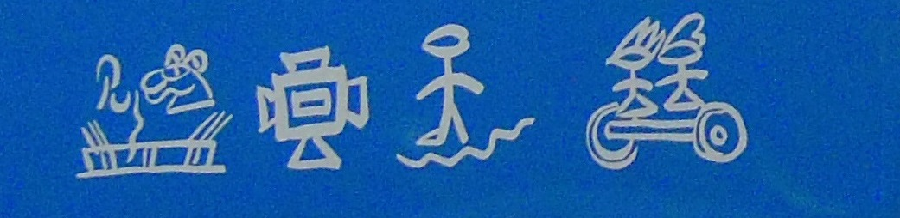

import ScriptDetails from '../../../../components/ScriptDetails.astro';
import WsList from '../../../../components/WsList.astro';
import ArticlesList from '../../../../components/ArticlesList.astro';
import SourcesList from '../../../../components/SourcesList.astro';
import Bibliography from '../../../../components/Bibliography.astro';

## Script details

<ScriptDetails />

## Script description

Naxi Dongba is a pictographic script used by the Naxi people of Yunnan Province in China.

Read the full description...
Its origin is a source of contention: some researchers believe it to have been invented in the 13th century, or possibly as early as the 7th century; others consider it more likely to have been invented as recently as the 18th century.  In the Naxi language, the script is called _²ss ³dgyu, ²lv ³dgyu_ ‘wood record, stone record’, testifying that the script was once carved on stone and wood.  Originally it was used by priests of the Dongba religion to write scriptures, and was passed on down the generations from father to son.  The Dongba religious corpus, comprising some one thousand ceremonies, is contained in Dongba script manuscripts. Today the script is still in use in the Lijiang region, not only to write scriptures but also to keep business records.  It is also used for everyday communication by some members of the Naxi community and has been called “the only living pictograph in the world”.

There are approximately 1200 single symbols in the script; some dictionaries contain as many as 3400 pictographs because they also include compound symbols.  Most symbols are pictograms, though some are used for their phonetic values according to the <a href='/reference/glossary#rebusp'>rebus principle</a>.

The Naxi language cannot be adequately expressed using the Dongba script alone, and it may be supplemented with the [Nakhi Geba](/scrlang/scripts/nkgb) syllabary for clarification. There have been attempts to revive the script, including visits by Dongba priests to local schools in the Lijiang region to teach classes on it.  In the 1980s some books were published in Naxi Dongba script, including textbooks for bilingual education.  However, due to its complexity, it can take up to 15 years to become proficient in the script.

## Languages that use this script

:::note
A status of _obsolete_ indicates that the writing system is no longer in use for that language; the language may still be spoken.
:::

<WsList script='Nkdb' wsMax='5' />

## Unicode status

The Naxi Dongba Pictographic script is not yet in Unicode. The script has a tentative allocation at U+1A800..U+1ACFF in the [Roadmap to the SMP](http://www.unicode.org/roadmaps/smp/) for the Unicode Standard. There seems to be disagreement on whether Naxi Dongba and Nakhi Geba should be considered the same script (see also the [Unicode Status (Nakhi Geba)](https://scriptsource.org/entry/k8fj7hdpny) entry).

- [Full Unicode status for Naxi Dongba](/scrlang/unicode/nkdb-unicode)

## Resources

<ArticlesList tag='script-nkdb' header='Related articles' />

<SourcesList tag='script-nkdb' header='External links' />

<Bibliography tag='script-nkdb' header='Bibliography' />

