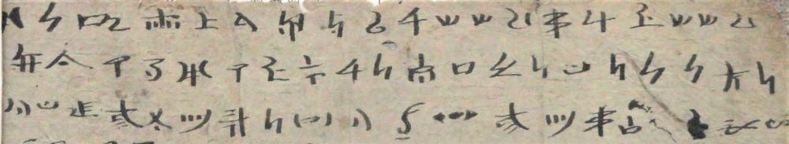

import ScriptDetails from '../../../../components/ScriptDetails.astro';
import ScriptResources from '../../../../components/ScriptResources.astro';
import WsList from '../../../../components/WsList.astro';

## Script details

<ScriptDetails />

## Script description

Nakhi Geba (also called 'Na-'Khi ²Ggŏ-¹baw or Naxi Geba) is one of three scripts used for writing the Naxi language, a Tibeto-Burman language spoken by approximately 310,000 people in the Chinese provinces of Yunnan and Sichuan, and in Tibet.

Read the full description...
Naxi has also been written in the Latin and, more famously, the Dongba scripts.

Nakhi Geba is thought to have been developed around 1200-1250 AD but was never widely used; its primary use was the transcription of religious mantras. There are few remaining texts in the script, and little is known about it. It was a syllabary, and the shapes of the letters appear to have been variously based on Chinese and Dongba characters, with some original designs.

## Languages that use this script

:::note
A status of _obsolete_ indicates that the writing system is no longer in use for that language; the language may still be spoken.
:::

<WsList script='Nkgb' wsMax='5' />

## Unicode status

The Naxi Geba script is not yet in Unicode. The script has a tentative allocation at U+1AD00..U+1AFCF in the [Roadmap to the SMP](http://www.unicode.org/roadmaps/smp/) for the Unicode Standard. There seems to be disagreement on whether Naxi Dongba and Nakhi Geba should be considered the same script (see also the [Unicode Status (Naxi Dongba)](https://scriptsource.org/entry/lb7t8h9k6v) entry).

- [Full Unicode status for Naxi Geba](/scrlang/unicode/nkgb-unicode)

## Resources

<ScriptResources detailSummary='seemore' />

