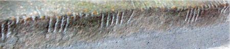

import ScriptDetails from '../../../../components/ScriptDetails.astro';
import WsList from '../../../../components/WsList.astro';
import ArticlesList from '../../../../components/ArticlesList.astro';
import SourcesList from '../../../../components/SourcesList.astro';
import BibList from '../../../../components/BibList.astro';

## Script details

<ScriptDetails />

## Script description

The Ogham script dates from approximately the 5th century AD and was used in Ireland, Wales, Devon, Cornwall, and the Isle of Man, until the 10th century.

Read the full description...
There were two written traditions; the earliest extant examples of the script are inscribed into stone, while post 7th century examples are more frequently written on manuscripts.

Ogham was used for writing the Primitive Irish, Old Irish, Pictish, and Old Norse languages. Inscriptions found in England and Wales are often accompanied by a Latin transcription, but the Irish inscriptions are not.

The script is comprised of twenty symbols. The first twelve symbols represent consonants and are composed of one to five horizontal, vertical or diagonal strokes. The following five symbols represent the vowels /a/, /o/, /u/, /e/, /i/ and appear as one to five short notches. The next symbol represents /k/ in the stone inscriptions but comes to represent /e/ in the manuscript tradition. The final four symbols are only attested in the manuscript tradition and represent diphthongs.

Early (inscribed) samples of the Ogham script begin at the bottom left of the stone and run up the left edge, along the top, and down the right-hand side. In later (manuscript) form, the script is usually written in <a href='/reference/glossary#boust'>boustrophedon</a> style or horizontally from left to right. Spaces were not left between words, nor was any punctuation used.

## Languages that use this script

:::note
A status of _obsolete_ indicates that the writing system is no longer in use for that language; the language may still be spoken.
:::

<WsList script='Ogam' wsMax='5' />

## Unicode status

In The Unicode Standard, Ogham script implementation is discussed in [Chapter 8 Europe-II — Ancient and Other Scripts](https://www.unicode.org/versions/latest/core-spec/chapter-8/#G29182).

- [Full Unicode status for Ogham](/scrlang/unicode/ogam-unicode)

## Resources

<ArticlesList tag='script-ogam' header='Related articles' />

<SourcesList tag='script-ogam' header='External links' entrytype='non-online' />

<BibList tag='script-ogam' header='Bibliography' entrytype='non-online' />

