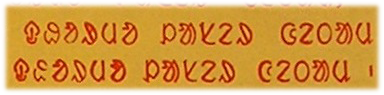

import ScriptDetails from '../../../../components/ScriptDetails.astro';
import ScriptResources from '../../../../components/ScriptResources.astro';
import WsList from '../../../../components/WsList.astro';

## Script details

<ScriptDetails />

## Script description

The Ol Chiki script (also called Ol Cemet', Ol, or Santali) was created by Pandit Raghunath Murmu in the 1920s for writing the Santali language, which is spoken by just under 6 million people in India, Bangladesh and Nepal.

Read the full description...
The Santali language is also written in the Devanagari, Bengali, Oriya and Roman scripts, and most people who are literate in Ol Chiki are also literate in at least one of the others. For this reason, not all Santali speakers are agreed as to the necessity of a unique script for their language, but despite competition from surrounding scripts, Ol Chiki is becoming more widely accepted. 

The script is an alphabet, that is, consonants and vowels are each written with independent letters. It is written from left to right. There are two forms of the script, printed and cursive, but the same principles are applied to both forms. Ol Chiki is written using thirty letters; six vowels and twenty-four consonants. The canonical order of the letters is in the form of a table having six rows and five columns, with the six vowels in the leftmost column. The letter names of the consonants are all in VC form where V is the vowel at the start of that row, for example in the row beginning with the vowel [ɔ] (called _Lɔ_), the following consonants are called _ɔT_, _ɔK'_, _ɔŋ_ and _ɔL_. Murmu ordered the alphabet in this way to facilitate memorization of the letters.

He also hoped to facilitate transmission of the script by employing symbols which were already familiar to Santali speakers, for example, symbols which were traditionally written on rocks and trees to communicate information such as "danger" or "meeting place". Both these traditional symbols and the modern Ol Chiki symbols are somewhat pictographic in nature, and the shapes of the letters reflect their names also. For example, _eḑ_ is both the name of the letter representing [ḑ] and is also a word meaning 'to point out a place', so the letter _ḑ_ was modified from a picture of a fist with a pointing finger. The shape was previously a symbol used to mark a meeting place. The shapes of letters which are not based on traditional symbols are based on the shape of the lips when articulating that sound.

The script is best suited to the southern dialect of Santali, which only uses six vowels. Other dialects use up to nine vowel sounds, which are represented in writing by applying a diacritic called _gaahlaa ttuddaag_ to three of the six basic vowels to create a total of nine vowel symbols. All vowels may be long or short, and/or nasalized. A sign called _relaa_ indicates length, and a sign called _mu ttuddag_ is used to indicate nasalization. More than one of these vowel modifier diacritics can be applied to a given vowel, for example to indicate a vowel which is not one of the basic six, and which is nasal.

Two other diacritics are used. A horizontal loop called _oh_ is added to the top right of a consonant letter to indicate aspiration. There is also a deglottalization diacritic called _ahad_. This symbol performs what is thought to be a unique feature among writing systems. Like the other Munda languages, spoken Santali includes a series of voiced and voiceless aspirated stops, and a series of word-final glottalized stops which alternates with the voiced series.

Ol Chiki used a set of script-specific digits, as well as two punctuation marks called _mucaad_ and _double mucaad_, which are used in a similar way to Devanagari _danda_ and _double danda_, or Latin full stop and comma. The Latin comma is also used, along with Latin quotation marks, question mark and exclamation mark. Latin full stop is never used as it is visually too similar to the _mu ttuddag_ diacritic.

## Languages that use this script

<WsList script='Olck' wsMax='5' />

## Unicode status

In The Unicode Standard, Ol Chiki script implementation is discussed in [Chapter 13 South and Central Asia-II: Other Modern Scripts](http://www.unicode.org/versions/latest/ch13.pdf).

- [Full Unicode status for Ol Chiki](/scrlang/unicode/olck-unicode)

## Resources

<ScriptResources detailSummary='seemore' />

