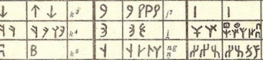

import ScriptDetails from '../../../../components/ScriptDetails.astro';
import ScriptResources from '../../../../components/ScriptResources.astro';
import WsList from '../../../../components/WsList.astro';

## Script details

<ScriptDetails />

## Script description

The Orkhon script was used for writing Turkic languages in Mongolia and Siberia from the 8th to the 13th centuries.

Read the full description...
The earliest examples of writing in any Turkic language were found on the banks of the Orkhon river, hence the name of this script. Following this discovery, other examples were found, written in variant forms of the script. For this reason, the term 'Orkhon' is sometimes used in a collective sense to refer to the Old Turkic scripts as a whole, and the other styles considered variant forms of it. The Orkhon style of Old Turkic is sometimes grouped with the Yenisei style and the pair referred to as Orkhon-Yenisei. The Orkhon style is the most widely-known form of Old Turkic writing.

Because the script bears an external resemblance to Germanic runes, it is sometimes referred to as 'runiform' or 'Orkhon runes'. However the similarity between Old Turkic and Germanic runic writing is almost certainly due to the stone writing surfaces on which they were both inscribed, rather that to any historical relationship between the two. Orkhon writing is thought either to have gradually developed from, or to have been invented by someone who was familiar with, an Aramaic-derived script. Sogdian is commonly cited as its most immediate known ancestor.

Orkhon writing was generally written right to left. Occasionally it was written in [boustrophedon](/reference/glossary#boust) style, in which case the individual letter shapes were reversed on alternate lines. Forty letters were used to represent twenty-six sounds. This apparent over-representation was due to a defective vowel notation system; four vowel letters represented at least eight vowel phonemes, but these were often not written. Instead, many of the consonants contained information about the vowel associated with them. Orkhon was unusual in that any vocalic information contained in the consonant related to the _preceding_ vowel, rather than the following one. The spoken Turkic languages employed (as they still do) strict vowel harmony principles, so that in a given word, only front or only back vowels - that is, vowels pronounced with the highest part of the tongue close to the front or the back of the mouth - were used. These principles could help predict the quality of vowels in a word, but even so, many consonant letters had two forms, one for front-vowelled and one for back-vowelled words. Some consonant letters also had a 'neutral' form and a form to indicate that the associated vowel was rounded and/or high (in terms of tongue height, as opposed to tone).

One punctuation mark, a two-dot symbol, was used for a variety of purposes.

Some scholars claim that Old Hungarian writing was derived from the Orkhon script, but this claim is controversial.

## Languages that use this script

<WsList script='Orkh' wsMax='5' />

## Unicode status

In The Unicode Standard, Old Turkic script implementation is discussed in [Chapter 14 South and Central Asia-III — Ancient Scripts](https://www.unicode.org/versions/latest/core-spec/chapter-14/#G41975).

- [Full Unicode status for Old Turkic](/scrlang/unicode/orkh-unicode)

## Resources

<ScriptResources detailSummary='seemore' />

