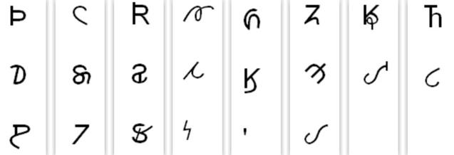

import ScriptDetails from '../../../../components/ScriptDetails.astro';
import WsList from '../../../../components/WsList.astro';
import ArticlesList from '../../../../components/ArticlesList.astro';
import SourcesList from '../../../../components/SourcesList.astro';
import Bibliography from '../../../../components/Bibliography.astro';

## Script details

<ScriptDetails />

## Script description

The Osage language is used in the United States.

Read the full description...
A variety of Latin-based orthographies have been used for the Osage language over the past 200+ years. As part of revitalization efforts, a new Osage orthography has been consistently and regularly used throughout the Osage Nation since 2006. The Osage script and Latin script were disunified by the Unicode Technical Committee in 2014. It was decided that the differences in Osage usage are significant enough that the Osage orthography should be considered a script in its own right. The script behaves very much like Latin as far as casing and glyph design are concerned. There are many characters in Osage which do not exist in Latin. Default sorting for the Osage script is completely different from Latin.

Osage uses standard European digits and punctuation.

## Languages that use this script

<WsList script='Osge' wsMax='5' />

## Unicode status

In The Unicode Standard, Osage script implementation is discussed in [Chapter 20:Americas](https://www.unicode.org/versions/latest/core-spec/chapter-20/#G26674).

- [Full Unicode status for Osage](/scrlang/unicode/osge-unicode)

## Resources

<ArticlesList tag='script-osge' header='Related articles' />

<SourcesList tag='script-osge' header='External links' />

<Bibliography tag='script-osge' header='Bibliography' />
