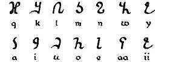

import ScriptDetails from '../../../../components/ScriptDetails.astro';
import ScriptResources from '../../../../components/ScriptResources.astro';
import WsList from '../../../../components/WsList.astro';

## Script details

<ScriptDetails />

## Script description

The Osmanya script (also known as far soomaali or cismaanya) was invented by Cismaan Yuusuf Keenadiid between 1920 and 1922.

Read the full description...
It was used sporadically from 1922-1973 for writing the Somali language. It was particularly used from 1961-1969, when it was officially approved alongside the Latin script by the newly democratic government. However, following a military coup in 1969, an intense literacy campaign using only the Latin script saw a sharp decline in Osmanya usage. In 1973 a standardised Latin orthography was adopted as the official script of the Somali language. Osmanya remained in limited use, predominantly in private correspondence and bookkeeping, although it is now considered to be unused except by Somali historians and scholars.

Osmanya is an alphabet, read from left to right, comprising 22 consonant and 8 vowel characters. The phonemic inventory contains 10 vowels - 5 short and 5 long; these are represented in the orthography by using the consonant characters _w_ and _y_ to represent long [u:] and long [i:]. Consonant lengthening ([gemination](/reference/glossary#gemination)) is represented by writing the consonant twice. Decimal digits from 0-9 are also represented in the Osmanya script. Characters are sorted according to the Arabic order.

## Languages that use this script

:::note
A status of _obsolete_ indicates that the writing system is no longer in use for that language; the language may still be spoken.
:::

<WsList script='Osma' wsMax='5' />

## Unicode status

In The Unicode Standard, Osmanya script implementation is discussed in [Chapter 19:Africa](https://www.unicode.org/versions/latest/core-spec/chapter-19/#G16914).

- [Full Unicode status for Osmanya](/scrlang/unicode/osma-unicode)

## Resources

<ScriptResources detailSummary='seemore' />

