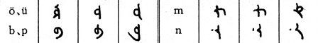

import ScriptDetails from '../../../../components/ScriptDetails.astro';
import WsList from '../../../../components/WsList.astro';
import ArticlesList from '../../../../components/ArticlesList.astro';
import SourceLinksList from '../../../../components/SourceLinksList.astro';
import BibList from '../../../../components/BibList.astro';

## Script details

<ScriptDetails />

## Script description

The Old Uighur language is an extinct variety of Old Turkic spoken in the Tarim basin.

Read the full description...
It is an ancestor of the modern Uyghur language. The language was written using what has been described as an “alphabetized abjad”, with <a href='/reference/glossary#matlec'>matres lectionis</a> used for indicating both long and short vowels. The Old Uyghur script was the prototype for the Mongolian and Manchu scripts.

## Languages that use this script

:::note
A status of _obsolete_ indicates that the writing system is no longer in use for that language; the language may still be spoken.
:::

<WsList script='Ougr' wsMax='5' />

## Unicode status

In The Unicode Standard, Old Uyghur script implementation is discussed in [Chapter 14: South and Central Asia-III — Ancient Scripts](https://www.unicode.org/versions/latest/core-spec/chapter-14/#G58161).

- [Full Unicode status for Old Uyghur](/scrlang/unicode/ougr-unicode)

## Resources

<ArticlesList tag='script-ougr' header='Related articles' />

<SourceLinksList tag='script-ougr' header='External links' entrytype='online' />

<BibList tag='script-ougr' header='Bibliography' entrytype='non-online' />

