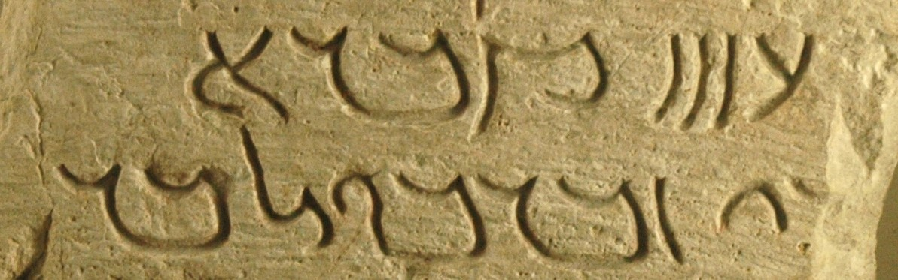

import ScriptDetails from '../../../../components/ScriptDetails.astro';
import ScriptResources from '../../../../components/ScriptResources.astro';
import WsList from '../../../../components/WsList.astro';

## Script details

<ScriptDetails />

## Script description

The Palmyrene script was derived from cursive versions of Aramaic writing around the 1st century BC.

Read the full description...
It was initially used in the area between the city of Damascus and the Euphrates river, for writing the Palmyrene (also called Palmyrenean) dialect of West Aramaic. The latest extant documents written in the script are from the year 273 AD, the year that the Palmyrene empire was sacked by the Roman Emperor Aurelian.

The script was written from right to left, generally without spaces between words.

There were two forms of the script; monumental and cursive. It appears that the cursive form was developed first and the monumental form was derived from it at a later date. Both forms employed ligatures, but few details are known about the nature of ligation in the script.

The Palmyrene script was deciphered in Paris in the mid-eighteenth century, following Abbé Barthélemy’s study of a number of bilingual Palmyrene/Greek inscriptions.

## Languages that use this script

<WsList script='Palm' wsMax='5' />

## Unicode status

In The Unicode Standard, Palmyrene script implementation is discussed in [Chapter 10 Middle East-II — Ancient Scripts](https://www.unicode.org/versions/latest/core-spec/chapter-10/#G29599).

- [Full Unicode status for Palmyrene](/scrlang/unicode/palm-unicode)

## Resources

<ScriptResources detailSummary='seemore' />

