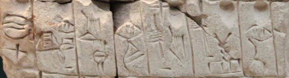

import ScriptDetails from '../../../../components/ScriptDetails.astro';
import WsList from '../../../../components/WsList.astro';
import ArticlesList from '../../../../components/ArticlesList.astro';
import SourcesList from '../../../../components/SourcesList.astro';
import Bibliography from '../../../../components/Bibliography.astro';

## Script details

<ScriptDetails />

## Script description

Proto-Cuneiform emerged towards the end of the fourth millennium B.C.

Read the full description...
in ancient Babylonia, a region of Mesopotamia that corresponds with the southern part of modern-day Iraq. This was a pictographic script. The signs were usually made on the soft surface of clay tablets with a stylus made from a reed. The clay tablets were then dried and hardened. Many such tablets have been found in archeological excavations in Uruk (Al Warka in present-day Iraq).

## Languages that use this script

<WsList script='Pcun' wsMax='5' />

## Unicode status

The Proto-Cuneiform script is not yet in Unicode. The script has a tentative allocation at U+12580..U+12ECF in the [Roadmap to the SMP](http://www.unicode.org/roadmaps/smp/) for the Unicode Standard.

- [Full Unicode status for Proto-Cuneiform](/scrlang/unicode/pcun-unicode)

## Resources

<ArticlesList tag='script-pcun' header='Related articles' />

<SourcesList tag='script-pcun' header='External links' />

<Bibliography tag='script-pcun' header='Bibliography' />

